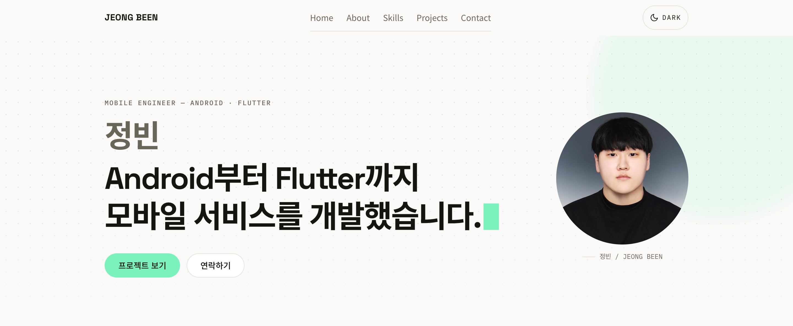
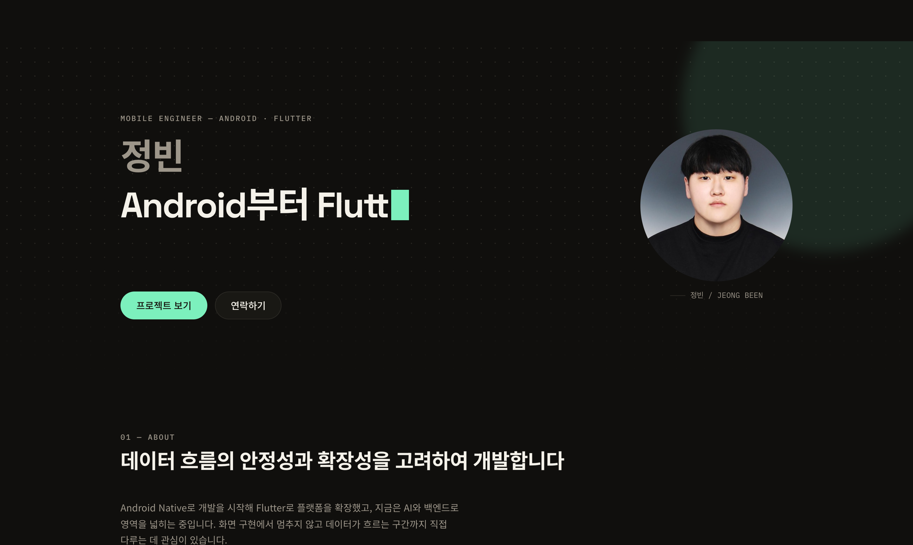
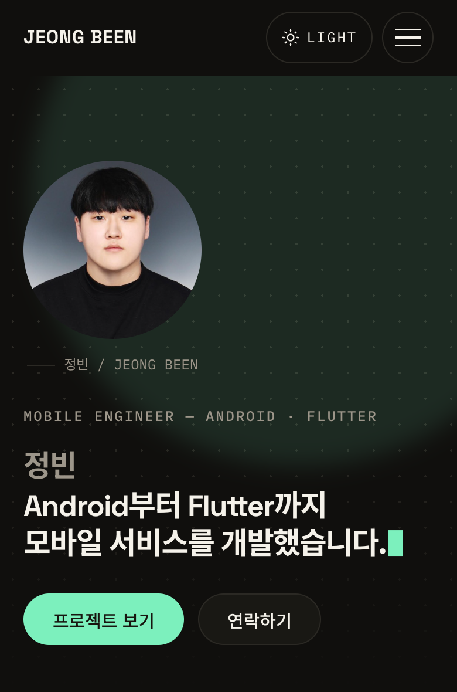

# Portfolio — 나를 소개하는 웹페이지

<p align="center">
  <b>프레임워크 없이 만든 반응형 포트폴리오</b><br/>
  이벤트에서 화면까지의 단방향 흐름을 직접 구현한 정적 웹사이트
</p>

<p align="center">
  
  
  
  
  
</p>

<p align="center">
  
</p>

<p align="center">
  <a href="https://b0e2.github.io/b1-1/"><b>배포 주소</b></a>
</p>

---

## Overview

자기소개와 작업물을 담은 한 페이지짜리 포트폴리오입니다.

라이브러리도 빌드 단계도 쓰지 않고 HTML · CSS · JavaScript 만으로 만들었습니다. 화면을 그리는 것보다 **어떤 값을 상태로 둘지, 그 상태가 언제 화면이 되는지** 정해 보는 것이 목적이었습니다.

## Problem

프레임워크가 상태와 렌더링을 대신 해 주면 그 사이가 가려집니다.

- 이벤트가 화면으로 이어지는 과정을 모른 채 쓰게 됨
- DOM 에서 값을 되읽기 시작하면 화면이 근거가 되어 상태와 어긋남
- 로딩 · 실패 · 빈 상태를 나중에 붙이면 화면마다 분기가 흩어짐

## Solution

- 상태를 바꾸는 길을 `setState` 하나로, 화면을 그리는 길을 구독자 통지 하나로 고정
- DOM 에서 값을 되읽는 코드를 두지 않음. 화면의 근거는 항상 상태 객체 하나
- 외부 데이터를 상태 네 개로 정의해 한 번에 하나만 그림
- 색과 간격을 CSS 변수로 모아 테마 전환을 속성 하나로 처리

## Core Features

- Hero · About · Skills · Projects · Contact · Footer 로 이어지는 한 페이지 구성
- GitHub 저장소 목록을 불러와 카드로 표시, 언어별 필터
- 불러오는 중 · 성공 · 실패 · 비어 있음 네 상태를 구분해 표시
- 응답을 10분 보관하고, 요청이 실패하면 저장해 둔 목록으로 대체
- 이름 · 이메일 · 메시지 검증 후 실제 메일 전송
- 밝게 / 어둡게 전환. 토글과 운영체제 설정 양쪽에서 동작
- 햄버거 메뉴, 부드러운 앵커 이동, 맨 위로 가기, 스크롤 등장 효과
- Hero 문구 타이핑 효과. 탭이 가려지면 멈춤

## Screens

| 프로젝트 목록 · 다크 | 모바일 · 다크 |
| --- | --- |
|  |  |

| 섹션 | 화면 |
| --- | --- |
| `#home` | 인사말 · 타이핑 문구 · 프로필 사진 · 바로가기 버튼 |
| `#about` | 자기소개와 지표 3종 |
| `#skills` | 기술 스택 카드 4장 |
| `#projects` | GitHub 저장소 카드 · 언어 필터 · 상태 화면 |
| `#contact` | 문의 폼과 전송 성공 패널 |

## Tech Stack

| Layer | Stack |
| --- | --- |
| Markup | `HTML5` 시맨틱 태그 |
| Styling | 순수 CSS, CSS 변수 기반 테마, Flexbox · Grid |
| Script | `ES Modules`, DOM API, `Fetch API`, `Intersection Observer` |
| Data | `GitHub REST API`, `localStorage` |
| Form | `Formspree` |
| Font | Space Grotesk, Noto Sans KR, IBM Plex Mono |
| Deploy | `GitHub Pages` |

UI 라이브러리와 빌드 도구는 쓰지 않았습니다. 파일이 그대로 배포됩니다.

```text
.
├── index.html          시맨틱 구조와 기능이 사용할 컨테이너
├── css/                진입점 1개 + 토큰 · 기본 · 배치 · 공통 · 섹션별 6개
├── js/
│   ├── main.js         초기화와 렌더 구독
│   ├── store.js        단일 상태 저장소
│   ├── dom.js          선택자와 escape
│   ├── github-api.js   저장소 요청 · 정규화 · 캐시
│   └── features/       기능 6개. 각자 이벤트 · 상태 변경 · 렌더를 소유
└── images/
```

`css/style.css` 의 `@import` 순서가 곧 의존 방향입니다. `tokens → base → layout → components → sections → projects → contact`

## Data

상태는 `js/store.js` 한 객체입니다.

| 경로 | 값 | 바꾸는 곳 |
| --- | --- | --- |
| `theme` | `light` \| `dark` | `theme.js` |
| `navigation.menuOpen` | 햄버거 메뉴 열림 | `navigation.js` |
| `navigation.isScrolled` | 헤더 임계값 넘김 | `navigation.js` |
| `navigation.showTopButton` | 맨 위로 버튼 임계값 넘김 | `navigation.js` |
| `projects.status` | `idle` \| `loading` \| `ready` \| `error` \| `empty` | `projects.js` |
| `projects.items` | 정규화된 저장소 배열 | `projects.js` |
| `projects.language` | 선택한 언어 필터 | `projects.js` |
| `projects.usedCache` `cachedAt` `cacheIsStale` | 캐시 안내 문구 선택용 | `projects.js` |
| `form.values` `touched` `errors` | 입력값 · 방문 여부 · 표시 중인 오류 | `contact-form.js` |
| `form.status` | `idle` \| `sending` \| `sent` \| `failed` | `contact-form.js` |

타이핑 위치와 등장 효과는 상태에 없습니다. 한 기능 안에서 끝나는 값이라 해당 모듈이 지역 변수로 들고 있습니다.

브라우저 저장소는 두 개를 씁니다.

| 키 | 값 |
| --- | --- |
| `portfolio-theme` | 마지막으로 정해진 테마 |
| `portfolio-repos:b0e2` | `{ savedAt, repositories }` · 10분간 유효 |

## Data Flow

```text
[ 사용자 동작 ]
   │  click · input · blur · submit · scroll · change
   ▼
features/*.js 핸들러
   │  1) 무엇이 달라졌는지 판단
   │  2) 달라졌을 때만 setState 호출
   ▼
store.js
   │  새 객체로 교체 → 구독자 전원에게 통지
   ▼
main.js renderApp
   │  renderTheme · renderNavigation · renderProjects · renderContactForm
   │  각 렌더러는 상태를 읽기만 하고 바꾸지 않는다
   ▼
[ DOM 갱신 ]

── 외부 데이터는 한 갈래 더 거친다 ──

projects.js loadProjects()
   │  status: loading
   ▼
github-api.js loadRepositories()
   │  유효한 캐시 있음        → 요청 없이 반환
   │  없거나 만료             → 요청 후 캐시 갱신
   │  요청 실패 + 캐시 있음   → 만료된 캐시로 대체 (isStale)
   │  요청 실패 + 캐시 없음   → 예외
   ▼
projects.js
   │  성공 → ready / empty      실패 → error
   ▼
[ 상태 하나가 화면 하나를 정한다 ]
```

## Technical Highlights

| Area | Decision | Impact |
| --- | --- | --- |
| File Separation | 구조 · 표현 · 동작을 파일로 나누고, JS 안에서도 기능별로 다시 나눔 | 서로 다른 이유로 바뀌는 것이 섞이지 않아 고칠 파일이 하나 |
| Semantic HTML | 제목을 가진 주제 단위는 `section`, 떼어 놓아도 말이 되는 단위는 `article` | 보조기술이 영역을 건너뛸 수 있고, 주석 없이 역할이 읽힘 |
| CSS Variables | 색을 역할 이름으로 정의하고 `data-theme` 으로 값만 교체 | 테마 전환이 속성 하나. JavaScript 가 색을 하나도 모름 |
| Event Binding | `onclick` 없이 `addEventListener`, 동적 요소는 부모에서 위임 | 마크업에 로직이 없고, `passive` 같은 옵션을 쓸 수 있음 |
| Flexbox vs Grid | 축이 하나면 Flex, 행과 열이 함께 바뀌면 Grid | 카드 그리드가 `auto-fit` 으로 미디어쿼리 없이 열 수를 정함 |
| Mobile First | 좁은 화면을 기본으로 두고 `min-width` 에서 더하기만 함 | 작은 화면에서 되돌리는 취소 규칙이 쌓이지 않음 |
| Single Store | 여러 곳이 읽고 다시 그리는 값만 한 객체에 모음 | 화면이 왜 이렇게 그려졌는지의 답이 항상 한곳에 있음 |
| Async Branching | 응답 코드를 담은 예외를 던지고 `catch` 에서 사유별 문구 선택 | 403 · 404 · 네트워크 실패를 같은 경로로 처리하되 안내는 다르게 |
| Render Guard | 내용이 달라졌을 때만 다시 그리고, 값이 다를 때만 대입 | 필터를 눌러도 포커스가 유지되고 입력 커서가 튀지 않음 |
| Escaping | 외부 문자열은 템플릿에 넣기 전 escape | 저장소 설명에 섞인 태그가 실행되지 않음 |
| Code Splitting | 없음. 파일을 그대로 서비스 | 빌드 단계가 없어 저장소와 배포본이 같음 |

## Troubleshooting

| Issue | Approach | Result |
| --- | --- | --- |
| 필터를 누를 때마다 버튼 포커스가 사라짐 | 언어 목록과 안내 문구가 달라졌을 때만 `innerHTML` 재생성 | 키보드로 칩을 이동해도 포커스가 유지됨 |
| 입력 도중 커서가 문자열 끝으로 튐 | 렌더에서 값이 실제로 다를 때만 `input.value` 에 대입 | 한글 조합 중에도 커서가 제자리 |
| `blur` 후 재검증이 오류 안내를 계속 읽음 | 필드별 안내는 `aria-describedby`, 제출 요약만 라이브 리전 | 타이핑을 방해하지 않으면서 제출 결과는 전달 |
| GitHub API 무인증 한도 60회를 금방 소진 | 응답을 10분 보관하고, 실패 시 만료된 캐시로 대체하며 안내 표시 | 한도를 넘겨도 빈 화면 대신 지난 목록을 보여 줌 |
| 768px 에서 Hero 문구가 세 줄이 되어 잘림 | 사진 칸이 텍스트를 좁히는 구간의 글자 크기를 폭에 비례시킴 | 320px 부터 1440px 까지 두 줄 유지 |
| 토글 후에는 운영체제 테마를 따라갈 길이 없음 | 저장값 우선을 버리고 마지막에 들어온 신호가 이기도록 변경 | 토글과 시스템 설정이 같은 무게로 동작 |
| 스크린샷마다 캐시 안내 유무가 달라짐 | 장마다 새 브라우저 컨텍스트에서 촬영 | 세 장의 조건이 같아짐 |
| 스크립트가 실패하면 등장 효과 대상이 영영 숨겨짐 | 숨김 규칙을 `.js-reveal` 스위치 안에 둠 | 스크립트가 없으면 콘텐츠가 그냥 보임 |

## Behavior Constants

| 항목 | 값 |
| --- | --- |
| 헤더 배경 전환 | `scrollY >= 60px` |
| 맨 위로 버튼 | `scrollY > 320px` |
| 등장 효과 | Intersection Observer threshold `0.2` |
| Hero 타이핑 | 입력 `70ms` · 삭제 `34ms` · 대기 `1.6s` |
| 프로젝트 캐시 | `10분` |
| 메시지 최소 길이 | 공백 제외 `10자` |
| 앵커 이동 보정 | `72px` |
| 브레이크포인트 | `768px` · `1024px` · `1180px` |

Hero 글자 크기만 고정값이 아니라 `clamp` 입니다. 타이핑 자리가 두 줄로 고정돼 있어, 좁은 구간에서는 폭에 비례해 줄어야 문구가 잘리지 않습니다.

## Accessibility

- 첫 Tab 에서 나타나는 본문 바로가기
- 앵커 이동 후 대상 섹션으로 포커스 이동
- 햄버거 메뉴 `aria-expanded` 동기화, Escape 로 닫고 포커스 복귀
- 프로젝트 상태별로 `role` 과 `aria-live` 교체. 오류만 `assertive`
- 장식 요소는 `aria-hidden`, 링크 목적은 별도 문구로 제공
- `prefers-reduced-motion` 에서 타이핑 · 커서 · 등장 이동 · 부드러운 스크롤 정지
- 버튼 터치 대상 44px 이상

## Running Locally

ES Modules 를 쓰므로 `file://` 이 아닌 HTTP 주소로 열어야 합니다.

```bash
git clone https://github.com/b0e2/b1-1.git
cd b1-1

python3 -m http.server 8000
```

http://127.0.0.1:8000 으로 접속합니다. VS Code 는 Live Server 로 `index.html` 을 열어도 됩니다.

GitHub API 는 인증 없이 시간당 60회 제한이 있습니다. 짧은 시간에 반복 새로고침하면 `403` 이 돌아오고, 그때는 에러 상태 화면이 표시됩니다.

## Deployment

`main` 브랜치의 `/ (root)` 를 GitHub Pages 가 서비스합니다. 빌드 단계가 없어 저장소 파일이 그대로 올라갑니다.

브랜치 전략은 git-flow 를 따릅니다. 이슈 등록 → `feature/#<번호>-<이름>` → `develop` PR → 릴리스 시점에 `main` 병합 순서입니다.

## Roadmap

- 프로젝트 카드에 주요 기술 태그 표시
- 저장소 설명을 직접 작성한 소개 문구로 교체
- Lighthouse 성능 · 접근성 점수 측정과 개선
- 방문자가 다크 모드를 시스템 기준으로 되돌리는 경로 제공
