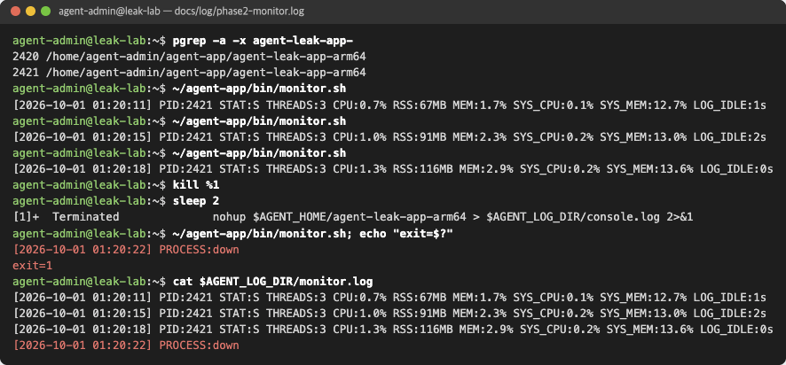
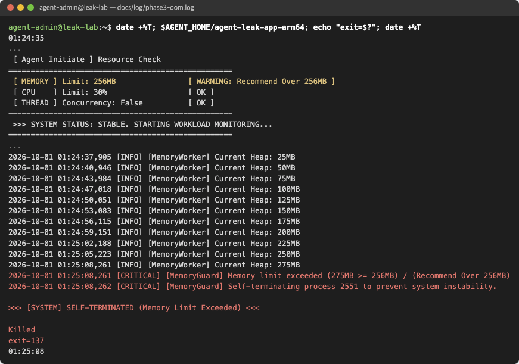
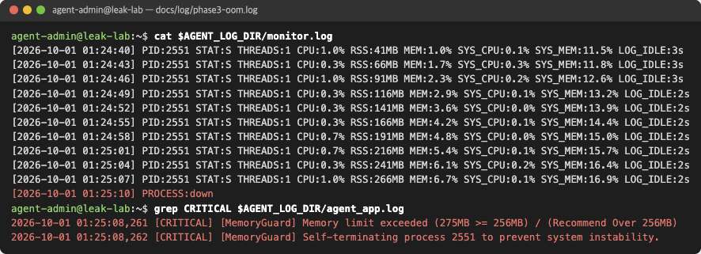
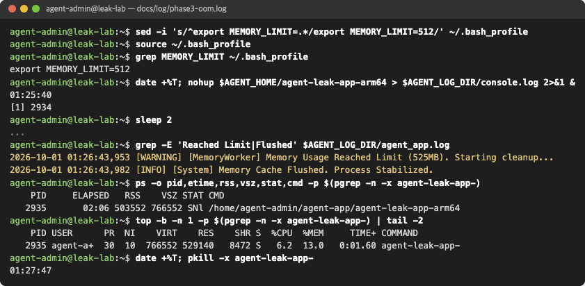
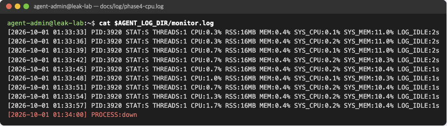
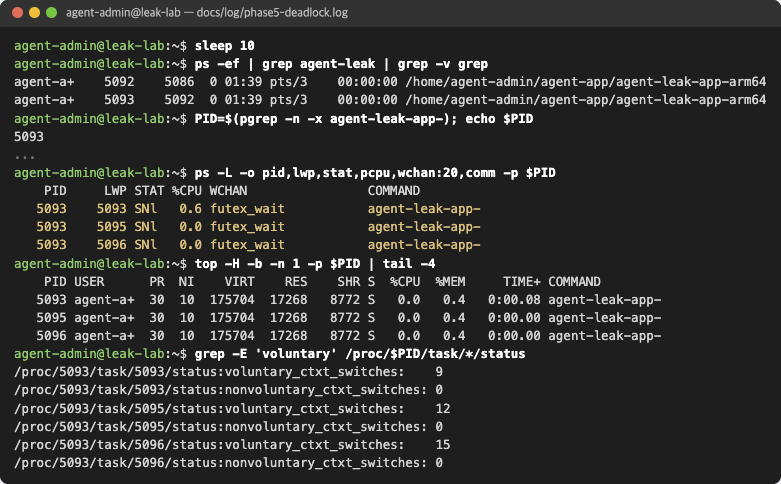
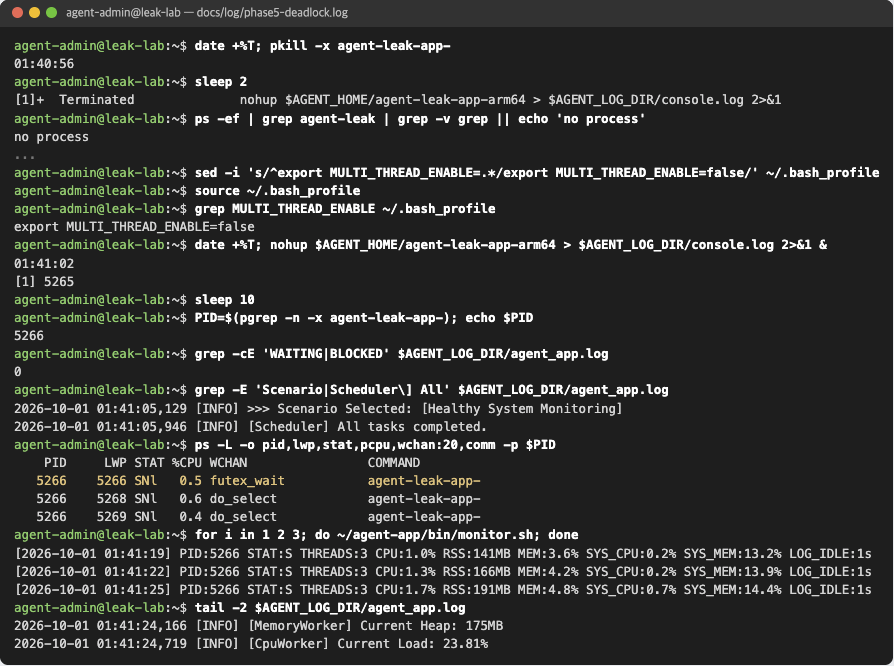
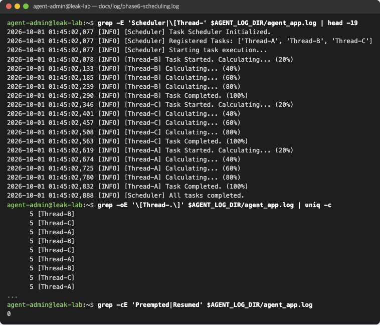

# B4-2 Linux 장애 분석

`agent-leak-app-arm64`에서 OOM, CPU 임계치 초과, Deadlock 장애를 재현하고
로그 및 시스템 상태를 분석하여 원인과 조치 결과를 확인하였다.

| 유형 | 리포트 | 조치 | 결과 |
| --- | --- | --- | --- |
| OOM | [#7](https://github.com/b0e2/b4-2/issues/7) | `MEMORY_LIMIT` 256 → 512 | 33초 종료 → 2분 이상 동작 |
| CPU | [#9](https://github.com/b0e2/b4-2/issues/9) | `CPU_MAX_OCCUPY` 80 → 30 | 30초 종료 → 1분 36초 이상 동작 |
| Deadlock | [#11](https://github.com/b0e2/b4-2/issues/11) | `MULTI_THREAD_ENABLE` true → false | 로그 정지 → 정상 진행 |
| Scheduling | [#13](https://github.com/b0e2/b4-2/issues/13) | - | 비선점형 Priority로 판단 |

---

## Environment

- OrbStack Linux machine `leak-lab` (Ubuntu 22.04.5 LTS, aarch64)
- 실행 계정 `agent-admin`, 환경 변수 `~agent-admin/.bash_profile`
- 기본 설정: `MEMORY_LIMIT=512`, `CPU_MAX_OCCUPY=30`, `MULTI_THREAD_ENABLE=false`
- 장애 재현 시 세 값 중 하나만 변경

---

## Monitoring Script

장애 발생 전·후의 CPU 및 메모리 사용량을 관제하기 위해 [`scripts/monitor.sh`](./scripts/monitor.sh)를 사용하였다.

- `pgrep -n -x agent-leak-app-`로 실제 동작하는 자식 프로세스 탐색
- `/proc/PID/stat` 기준 3초 동안의 프로세스 CPU 사용률 계산
- RSS를 MB 및 백분율로 기록, 시스템 전체 CPU·MEM 사용률 함께 기록
- 앱 로그 마지막 기록 이후 경과 시간(`LOG_IDLE`) 기록
- 결과를 `$AGENT_LOG_DIR/monitor.log`에 기록, 프로세스가 없으면 `PROCESS:down`



---

## 1. OOM / Memory Leak

### Before

- 설정: `MEMORY_LIMIT=256`
- Heap 사용량: `25MB → 50MB → ... → 275MB`
- `MemoryGuard`에서 메모리 한계 초과 감지
- 프로세스 Self-termination 발생 (exit 137, SIGKILL), 생존 33초



**관제 결과**
- 실제 메모리 사용량(RSS): `41MB → 66MB → 91MB → ... → 266MB`
- 3초마다 약 25MB씩 선형 증가, CPU와 스레드 수는 변화 없음
- 시스템 메모리 사용률은 16.9%로 커널 OOM 상황이 아님



### After

- 설정 변경: `MEMORY_LIMIT=256 → 512`
- 525MB 도달 시 종료 대신 `Memory Cache Flushed` 후 동작 유지
- 2분 7초 이상 동작 후 수동 종료



**관제 결과**
- 실제 메모리 사용량: `392MB → 517MB → 17MB → 42MB → ...`
- 정리 후에도 같은 속도로 다시 증가


**분석**
- 원인: 힙에 할당한 데이터가 해제되지 않고 누적되어 설정 한계 도달
- 조치: `MEMORY_LIMIT` 상향 (128MB 17초, 256MB 33초 → 512MB 2분 이상)
- 결과: 종료는 피하지만 메모리 증가 자체는 해결되지 않음

---

## 2. CPU Threshold / Process Termination

### Before

- 설정: `CPU_MAX_OCCUPY=80`
- 내부 `Current Load`: `5% → 54.14%`
- `CPU Threshold Violated` 발생
- `WATCHDOG: INITIATING EMERGENCY ABORT (SIGTERM)`, exit 143, 생존 30초


**관제 결과**
- 프로세스 CPU 사용률: `0.3% → 1.7%`
- 같은 구간 시스템 idle은 `99.6~99.8%`로 변화 없음
- 부하 작업이 약 3.1초마다 0.1초 동안만 실행되어 절대값은 낮음 (54% × 0.1초 / 3.1초 ≈ 1.7%)




### After

- 설정 변경: `CPU_MAX_OCCUPY=80 → 30`
- 내부 부하 30% 도달 시 cooldown 시작
- 약 5%까지 감소 후 다시 증가
- 프로세스 종료 없이 1분 36초 이상 동작


**관제 결과**
- 프로세스 CPU 사용률: 대부분 `0.7~2.0%` (순간 최대 5.3%)
- 프로세스 정상 유지


**분석**
- 원인: 부하가 Watchdog 기준(약 50%)을 넘어 보호 종료 발생. `CPU_MAX_OCCUPY=100`에서도 51.63%에서 종료
- 조치: `CPU_MAX_OCCUPY=30`으로 하향
- 결과: 임계치 초과 대신 cooldown 동작, 프로세스 정상 유지

---

## 3. Deadlock

### Before

- 설정: `MULTI_THREAD_ENABLE=true`
- Thread-1: `Shared_Memory_A` 획득 → `Socket_Pool_B` 대기
- Thread-2: `Socket_Pool_B` 획득 → `Shared_Memory_A` 대기
- 두 스레드 모두 `WAITING ... BLOCKED`
- 작업 진행 중단


**프로세스 / 스레드 확인**
- PID `5092`, `5093` 계속 존재
- 스레드 3개 모두 `%CPU=0.0`, `futex_wait` 대기
- 프로세스는 살아 있으나 작업은 진행되지 않음



**정체 확인**
- `top -H`의 TIME+, RES와 스레드별 문맥 교환 횟수가 40초 동안 동일
- `agent_app.log` 크기 `1517 bytes`가 30초 동안 동일, `LOG_IDLE` `8s → 56s`
- 15034 포트는 계속 점유


### After

- 설정 변경: `MULTI_THREAD_ENABLE=true → false`
- `WAITING ... BLOCKED` 미발생 (0건)
- 워커 스레드 `do_select`, 작업 로그 정상 진행



**분석**
- 원인: 두 스레드 간 Lock의 순환 대기 (상호 배제, 점유 대기, 비선점, 순환 대기)
- 조치: 멈춘 프로세스 `pkill` 정리 후 `MULTI_THREAD_ENABLE=false`
- 결과: 교착 상태 해소 및 정상 진행 확인

---

## 4. Scheduling

- 정상 설정으로 3회 실행하여 Scheduler 작업 로그 수집
- 등록 순서는 `Thread-A, B, C`, 실행 순서는 3회 모두 `B → C → A`
- 작업마다 20% → 100% 연속 실행, `Preempted` / `Resumed` 0건



**분석**
- Round-Robin 아님: 작업 중간 교체 없음
- FCFS 아님: 등록 순서와 실행 순서가 다름
- 결론: 비선점형 Priority (B > C > A)
- 우선순위가 낮은 A의 대기가 가장 김 (542ms). 중요도가 분명한 배치 처리에 적합하고, 고른 응답 시간이 필요한 웹 서버에는 선점형이 적합

---

## Docs

| 단계 | 문서 | 기록 |
| --- | --- | --- |
| 0. 실습 환경 | [phase0-setup.md](./docs/md/phase0-setup.md) | [phase0-setup.log](./docs/log/phase0-setup.log) |
| 1. 앱 실행 환경 | [phase1-app-env.md](./docs/md/phase1-app-env.md) | [phase1-app-env.log](./docs/log/phase1-app-env.log) |
| 2. monitor.sh | [phase2-monitor.md](./docs/md/phase2-monitor.md) | [phase2-monitor.log](./docs/log/phase2-monitor.log) |
| 3. OOM | [phase3-oom.md](./docs/md/phase3-oom.md) | [phase3-oom.log](./docs/log/phase3-oom.log) |
| 4. CPU | [phase4-cpu.md](./docs/md/phase4-cpu.md) | [phase4-cpu.log](./docs/log/phase4-cpu.log) |
| 5. Deadlock | [phase5-deadlock.md](./docs/md/phase5-deadlock.md) | [phase5-deadlock.log](./docs/log/phase5-deadlock.log) |
| 6. Scheduling | [phase6-scheduling.md](./docs/md/phase6-scheduling.md) | [phase6-scheduling.log](./docs/log/phase6-scheduling.log) |

```
b4-2/
├── README.md
├── scripts/
│   └── monitor.sh
└── docs/
    ├── md/        단계별 진행 문서
    ├── log/       단계별 터미널 기록
    └── images/    터미널 기록 발췌 화면
```
