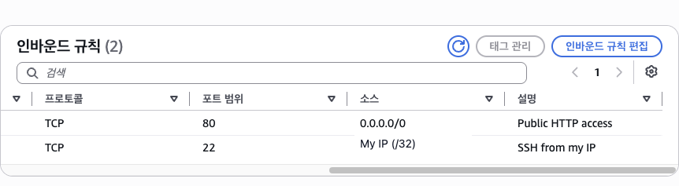
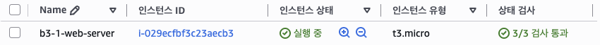

# b3-1

AWS EC2에서 Docker 기반 웹 서비스를 실행하는 배포 프로젝트입니다.

VPC와 Public Subnet을 구성하고, 호스트 Nginx를 Reverse Proxy로 사용해 Docker 컨테이너로 요청을 전달합니다. 외부 통신에는 HTTPS를 적용하고 `/health` 엔드포인트로 서비스 상태를 확인합니다.

## Service URL

- Web: https://b0e2-b3.ddns.net
- Healthcheck: https://b0e2-b3.ddns.net/health
- Repository: https://github.com/b0e2/b3-1

## Architecture


### Request Flow

```text
Internet
→ No-IP DNS
→ Internet Gateway
→ Public Subnet
→ Security Group
→ EC2 Host Nginx
→ 127.0.0.1:8080
→ Docker Nginx
→ Web Service
```

## Infrastructure

| 항목 | 설정 |
|---|---|
| Region | `ap-northeast-2` |
| VPC | `10.0.0.0/16` |
| Public Subnet | `10.0.1.0/24` |
| Instance | AWS EC2 `t3.micro` |
| Operating System | Ubuntu |
| DNS | No-IP |
| Reverse Proxy | Host Nginx |
| Container | Docker Nginx |
| HTTPS | Let’s Encrypt, Certbot |

## Security

| 포트 | 용도 | 접근 범위 |
|---:|---|---|
| 22 | SSH | 개인 공인 IP `/32` |
| 80 | HTTP | `0.0.0.0/0`, HTTPS로 리디렉션 |
| 443 | HTTPS | `0.0.0.0/0` |
| 8080 | Docker | `127.0.0.1`에서만 접근 |

Docker 컨테이너는 외부에 직접 공개하지 않고 호스트 Nginx를 통해서만 접근합니다.

## Repository Structure

```text
.
├── app/
│   └── index.html
├── docs/
│   ├── architecture.png
│   ├── troubleshooting.md
│   ├── cleanup-checklist.md
│   └── screenshots/
├── nginx/
│   └── site.conf
├── Dockerfile
└── README.md
```

## Docker

### Build

```bash
docker build -t b3-1-web:1.4 .
```

### Run

```bash
docker run -d \
  --name b3-1-web \
  --restart unless-stopped \
  -p 127.0.0.1:8080:80 \
  b3-1-web:1.4
```

### Healthcheck

```bash
docker inspect \
  --format='{{.State.Health.Status}}' \
  b3-1-web
```

Expected result:

```text
healthy
```

## Nginx Reverse Proxy

외부 요청은 호스트 Nginx가 받아 Docker 컨테이너로 전달합니다.

```text
Host Nginx :80/:443
→ 127.0.0.1:8080
→ Docker Nginx :80
```

HTTP 요청은 HTTPS로 리디렉션됩니다.

## Verification

### HTTPS

```bash
curl -I https://b0e2-b3.ddns.net
```

### HTTP Redirect

```bash
curl -I http://b0e2-b3.ddns.net
```

Expected response:

```text
HTTP/1.1 301 Moved Permanently
Location: https://b0e2-b3.ddns.net/
```

### Healthcheck

```bash
curl https://b0e2-b3.ddns.net/health
```

Expected response:

```text
OK
```

## Deployment Evidence

### 1. AWS Infrastructure

<table>
  <tr>
    <td width="50%">
      <strong>Security Group Inbound Rules</strong><br>
      
    </td>
    <td width="50%">
      <strong>EC2 Running</strong><br>
      
    </td>
  </tr>
  <tr>
    <td width="50%">
      <strong>EC2 Status Checks</strong><br>
      
    </td>
    <td width="50%">
      <strong>SSH Connection</strong><br>
      
    </td>
  </tr>
  <tr>
    <td colspan="2">
      <strong>EC2 Outbound Connection</strong><br>
      
    </td>
  </tr>
</table>

### 2. HTTP and Docker Deployment

<table>
  <tr>
    <td colspan="2">
      <strong>Docker Container Health</strong><br>
      
    </td>
  </tr>
  <tr>
    <td width="50%">
      <strong>External HTTP Web Access</strong><br>
      
    </td>
    <td width="50%">
      <strong>External HTTP Healthcheck</strong><br>
      
    </td>
  </tr>
</table>

### 3. DNS and HTTPS

<table>
  <tr>
    <td width="50%">
      <strong>DNS A Record</strong><br>
      
    </td>
    <td width="50%">
      <strong>HTTPS Security Group Rule</strong><br>
      
    </td>
  </tr>
  <tr>
    <td width="50%">
      <strong>Let’s Encrypt Certificate</strong><br>
      
    </td>
    <td width="50%">
      <strong>HTTP to HTTPS Redirect</strong><br>
      
    </td>
  </tr>
  <tr>
    <td colspan="2">
      <strong>Docker Health after HTTPS Deployment</strong><br>
      
    </td>
  </tr>
</table>

### 4. Final HTTPS Verification

#### Web Service


#### Healthcheck


## Certificate Renewal

인증서 자동 갱신 설정은 다음 명령으로 검증했습니다.

```bash
sudo certbot renew --dry-run
```

자동 갱신 시뮬레이션이 정상적으로 완료되는 것을 확인했습니다.

## Documentation

- [Troubleshooting](docs/troubleshooting.md)
- [Cleanup Checklist](docs/cleanup-checklist.md)
