# b3-1

AWS EC2에서 Docker 기반 웹 서비스를 운영하는 배포 프로젝트입니다.

VPC와 퍼블릭 서브넷을 구성하고, 호스트 Nginx를 리버스 프록시로 사용해 Docker 컨테이너로 요청을 전달합니다. 외부 통신에는 HTTPS를 적용하고 `/health` 엔드포인트로 서비스 상태를 확인합니다.

> 평가가 끝나 AWS 리소스와 도메인을 모두 삭제했습니다. 아래 주소는 운영 당시 기록이며 현재는 접속되지 않습니다. 정리 내역은 [Cleanup Evidence](docs/cleanup-evidence.md) 에 있습니다.

## Service URL (운영 종료)

| 항목 | 주소 |
|---|---|
| Web | `https://b0e2-b3.ddns.net` |
| Healthcheck | `https://b0e2-b3.ddns.net/health` |

동일한 구성은 `scripts/create-infra.sh` 와 `scripts/provision.sh` 로 재현할 수 있습니다.

## Architecture

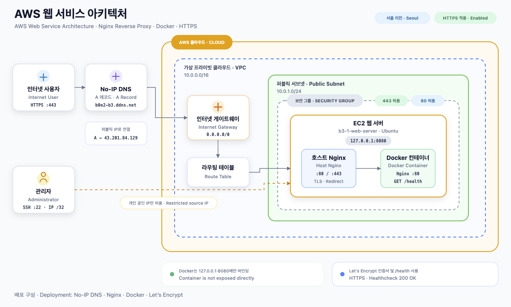

### Request Flow

```text
Internet
→ No-IP DNS
→ Internet Gateway
→ Public Subnet
→ Security Group
→ EC2 Host Nginx
→ 127.0.0.1:8080
→ Docker Nginx
→ Web Service
```

## Infrastructure

| 항목 | 설정 |
|---|---|
| Region | `ap-northeast-2` |
| VPC | `10.0.0.0/16` |
| Public Subnet | `10.0.1.0/24` |
| Availability Zone | `ap-northeast-2a` |
| Instance | AWS EC2 `t3.micro` |
| Operating System | Ubuntu 24.04 LTS |
| Root Volume | gp3 8 GiB, 종료 시 삭제 |
| DNS | No-IP |
| Reverse Proxy | Host Nginx |
| Container | Docker Nginx |
| HTTPS | Let’s Encrypt, Certbot |

## Network Routing

퍼블릭 서브넷은 아래 라우팅 테이블을 사용합니다.

| 대상 | 다음 홉 | 용도 |
|---|---|---|
| `10.0.0.0/16` | `local` | VPC 내부 통신 |
| `0.0.0.0/0` | `igw-...` | 인터넷 구간 송수신 |

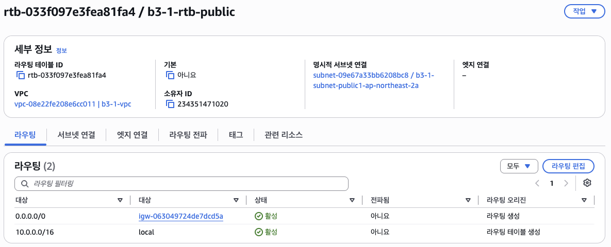

### 기본 경로가 필요한 이유

`0.0.0.0/0 → 인터넷 게이트웨이` 경로가 없으면 인스턴스는 퍼블릭 서브넷에 있어도 외부와 통신할 수 없습니다. 이 구성에서는 다음 작업에 아웃바운드가 필요합니다.

- `apt` 패키지 설치와 보안 업데이트
- Docker 이미지 내려받기
- GitHub 저장소 클론
- Let’s Encrypt 인증서 발급과 자동 갱신

인바운드 요청 역시 같은 경로를 통해 들어옵니다. 서브넷을 퍼블릭으로 만드는 것은 이 라우팅 설정이며, 이름이나 CIDR이 아닙니다.

## Security

### 포트 정책

| 포트 | 용도 | 접근 범위 |
|---:|---|---|
| 22 | SSH | 관리자 공인 IP `/32` |
| 80 | HTTP | `0.0.0.0/0`, HTTPS로 리디렉션 |
| 443 | HTTPS | `0.0.0.0/0` |
| 8080 | Docker | `127.0.0.1` 에서만 접근 |

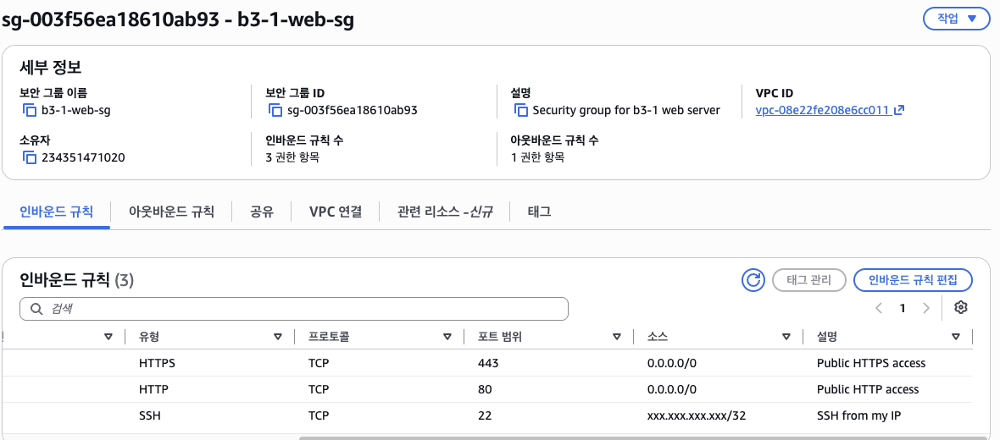

SSH 허용 대역은 `203.0.113.10/32` 와 같은 단일 호스트 형식으로 지정합니다. 위 화면의 실제 주소는 공개하지 않기 위해 가렸습니다.

### `0.0.0.0/0` 사용 기준

80과 443은 불특정 사용자가 접속해야 하므로 전체 공개가 필요합니다. 반면 22번 포트를 전체 공개하면 다음 위험이 있습니다.

- 자동화된 포트 스캐닝 대상이 됨
- 비밀번호 무차별 대입 시도 증가
- 취약한 설정이 있을 때 즉시 악용 가능

그래서 관리 포트는 다음 대안 중 하나로 제한합니다.

| 방법 | 설명 |
|---|---|
| 허용 IP 제한 | 관리자 공인 IP `/32` 만 허용, 이 프로젝트에서 사용 |
| Bastion Host | 별도 점프 서버를 통해서만 내부 접근 |
| VPN | 사설 네트워크 연결 후 접근 |
| SSM Session Manager | 22번 포트를 열지 않고 접속 |

컨테이너 포트 역시 `127.0.0.1:8080` 으로만 바인딩해 외부에 직접 노출하지 않습니다.

### Security Group과 IAM

| 구분 | Security Group | IAM |
|---|---|---|
| 통제 대상 | 네트워크 트래픽 | AWS API 권한 |
| 판단 기준 | 포트, 프로토콜, 출발지 | 액션, 리소스, 조건 |
| 예시 | 22번 포트를 관리자 IP에만 허용 | 인스턴스 종료 권한 부여 여부 |

두 계층은 서로를 대체하지 않습니다. 자세한 정책 예시와 권한 축소 절차는 [IAM and Least Privilege](docs/iam-least-privilege.md) 에 정리했습니다.

## Naming and Tagging

모든 리소스에 프로젝트 접두사와 공통 태그를 적용합니다.

| 키 | 값 |
|---|---|
| `Name` | `b3-1-web-server` 형식 |
| `Project` | `b3-1` |
| `Env` | `lab` |
| `Owner` | `jeongbeen` |
| `ManagedBy` | `console` 또는 `create-infra-script` |

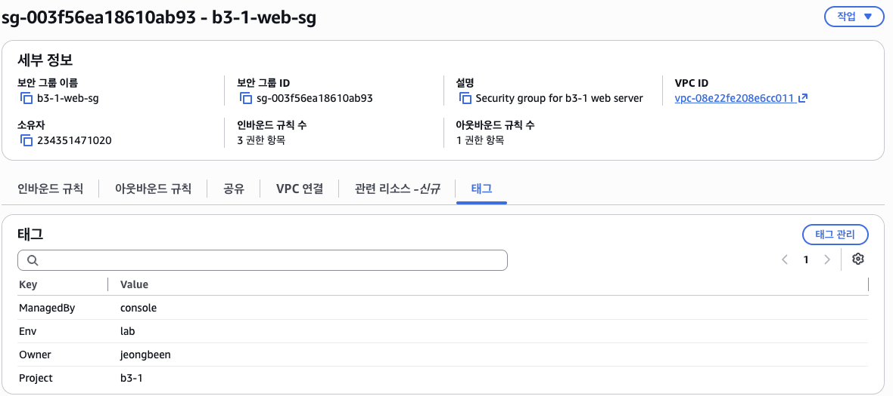

태그 기준으로 리소스를 조회하고 일괄 정리할 수 있습니다. 규칙은 [Naming and Tagging](docs/naming-and-tagging.md) 을 참고하세요.

## Repository Structure

```text
.
├── app/
│   └── index.html
├── docs/
│   ├── architecture.png
│   ├── cleanup-checklist.md
│   ├── cleanup-evidence.md
│   ├── https-setup.md
│   ├── iam-least-privilege.md
│   ├── naming-and-tagging.md
│   ├── network-troubleshooting.md
│   ├── scaling-and-cost.md
│   ├── troubleshooting.md
│   └── screenshots/
├── nginx/
│   └── site.conf
├── scripts/
│   ├── create-infra.sh
│   ├── provision.sh
│   ├── setup-https.sh
│   └── teardown-infra.sh
├── Dockerfile
└── README.md
```

## Scripts

| 스크립트 | 용도 |
|---|---|
| `scripts/create-infra.sh` | VPC, 서브넷, IGW, 라우팅, 보안 그룹, 인스턴스 생성 |
| `scripts/provision.sh` | Docker, Nginx, 컨테이너, 리버스 프록시 구성 |
| `scripts/setup-https.sh` | 인증서 발급과 자동 갱신 점검 |
| `scripts/teardown-infra.sh` | 태그 기준 리소스 삭제 |

```bash
SSH_CIDR=203.0.113.10/32 ./scripts/create-infra.sh
```

## Docker

### Build

```bash
docker build -t b3-1-web:1.4 .
```

### Run

```bash
docker run -d \
  --name b3-1-web \
  --restart unless-stopped \
  -p 127.0.0.1:8080:80 \
  b3-1-web:1.4
```

### Healthcheck

```bash
docker inspect --format='{{.State.Health.Status}}' b3-1-web
```

```text
healthy
```

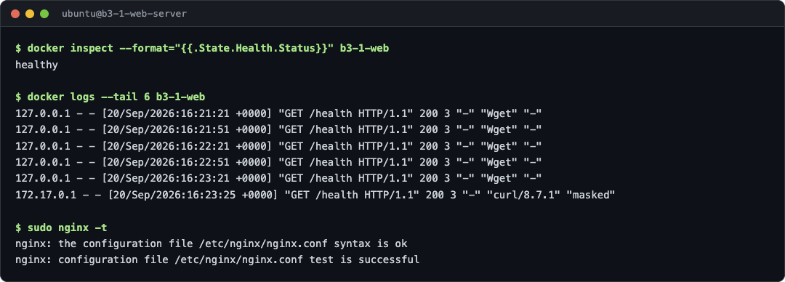

## Nginx Reverse Proxy

```text
Host Nginx :80/:443
→ 127.0.0.1:8080
→ Docker Nginx :80
```

HTTP 요청은 HTTPS로 리디렉션됩니다.

## Verification

### HTTPS와 리디렉션

```bash
curl -i https://b0e2-b3.ddns.net/health
curl -I http://b0e2-b3.ddns.net
```

```text
HTTP/1.1 200 OK
Server: nginx/1.24.0 (Ubuntu)
Content-Type: text/plain
Content-Length: 3

OK

HTTP/1.1 301 Moved Permanently
Server: nginx/1.24.0 (Ubuntu)
Location: https://b0e2-b3.ddns.net/
```

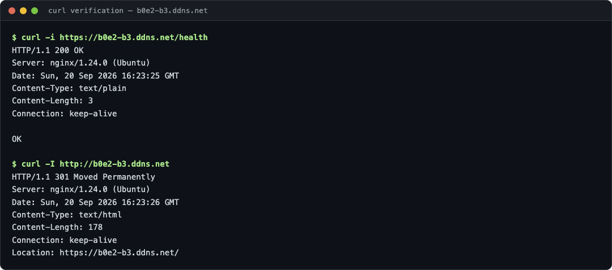

### 인증서 자동 갱신

```bash
sudo certbot renew --dry-run
```

```text
Congratulations, all simulated renewals succeeded
```

## Deployment Evidence

### 1. 인프라

<table>
  <tr>
    <td width="50%">
      <strong>EC2 인스턴스 상태</strong><br>
      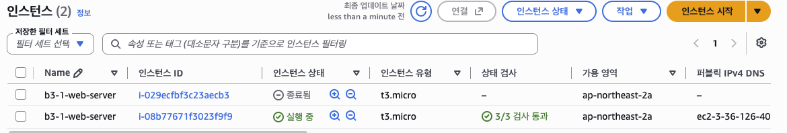
    </td>
    <td width="50%">
      <strong>SSH 접속</strong><br>
      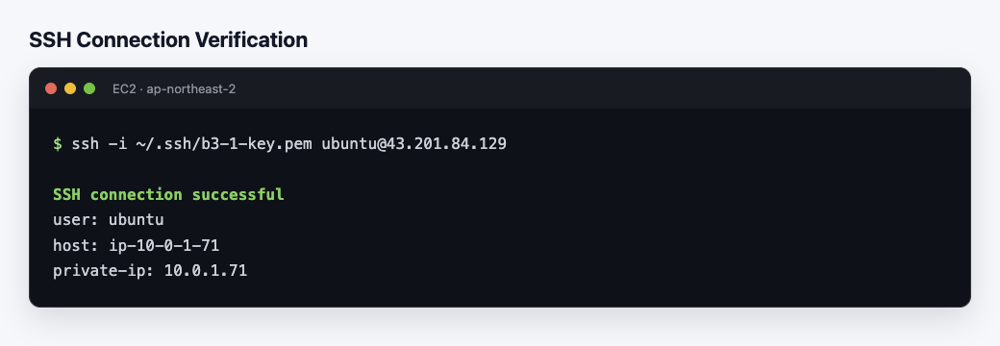
    </td>
  </tr>
  <tr>
    <td width="50%">
      <strong>라우팅 테이블</strong><br>
      
    </td>
    <td width="50%">
      <strong>보안 그룹 규칙</strong><br>
      
    </td>
  </tr>
  <tr>
    <td colspan="2">
      <strong>아웃바운드 통신 확인</strong><br>
      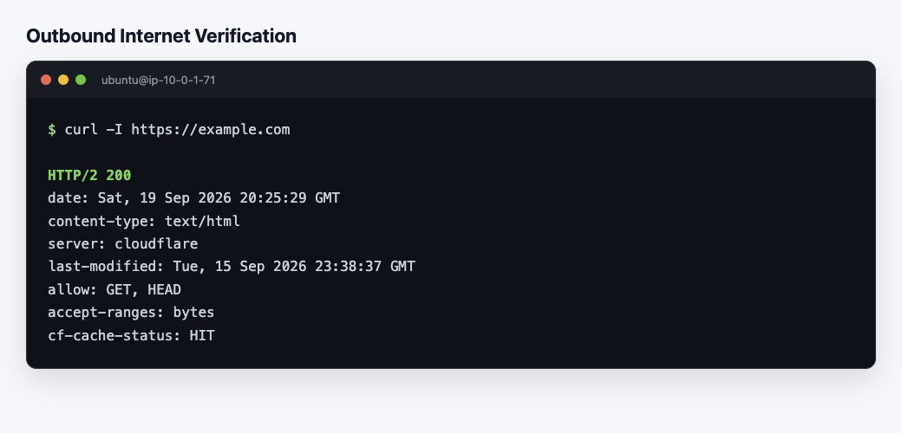
    </td>
  </tr>
</table>

### 2. HTTP 단계 배포

<table>
  <tr>
    <td colspan="2">
      <strong>컨테이너 상태</strong><br>
      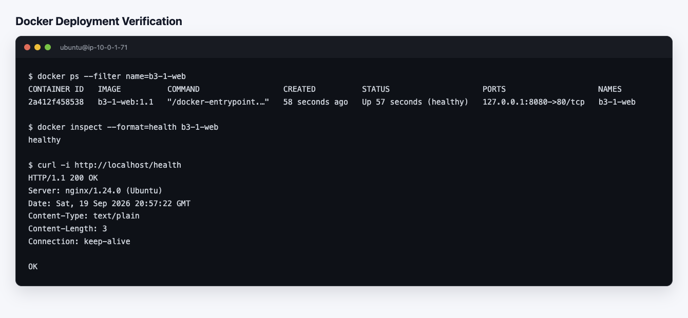
    </td>
  </tr>
  <tr>
    <td width="50%">
      <strong>외부 HTTP 접속</strong><br>
      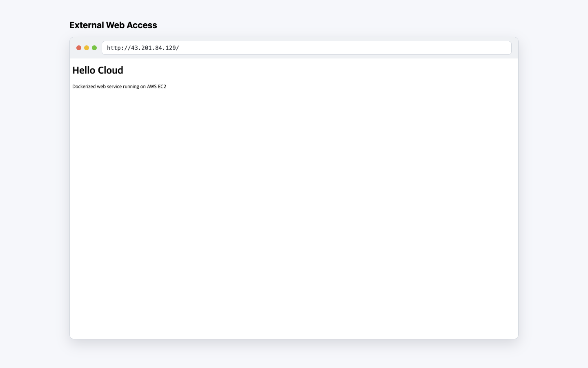
    </td>
    <td width="50%">
      <strong>외부 HTTP 상태 확인</strong><br>
      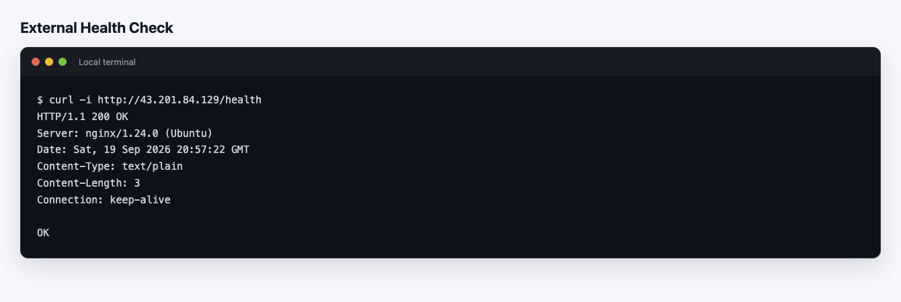
    </td>
  </tr>
</table>

### 3. DNS와 HTTPS

<table>
  <tr>
    <td width="50%">
      <strong>DNS A 레코드</strong><br>
      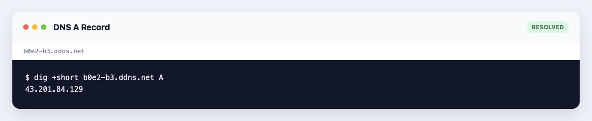
    </td>
    <td width="50%">
      <strong>HTTPS 보안 그룹 규칙</strong><br>
      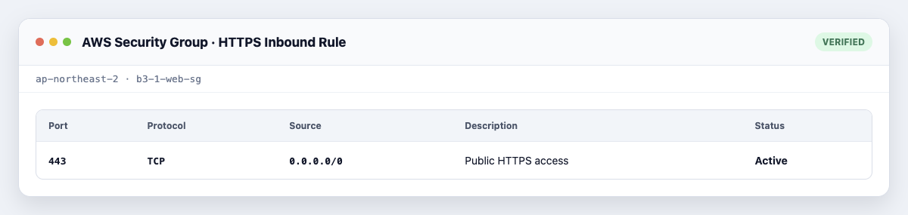
    </td>
  </tr>
  <tr>
    <td width="50%">
      <strong>Let’s Encrypt 인증서</strong><br>
      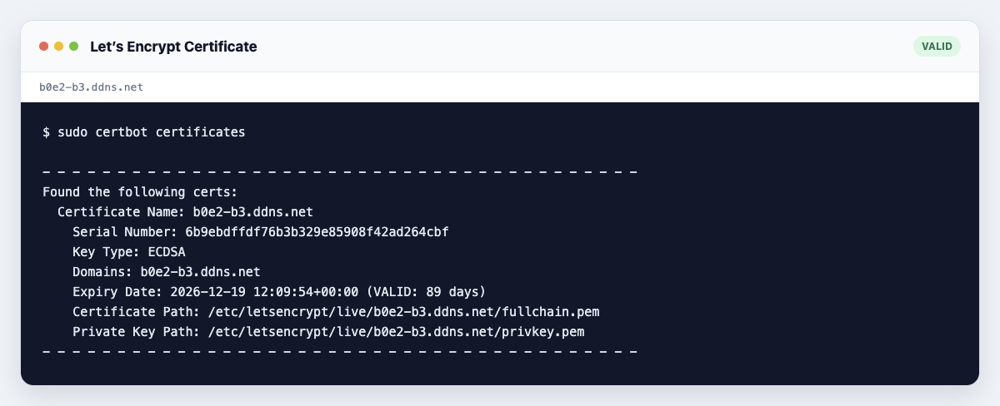
    </td>
    <td width="50%">
      <strong>HTTP → HTTPS 리디렉션</strong><br>
      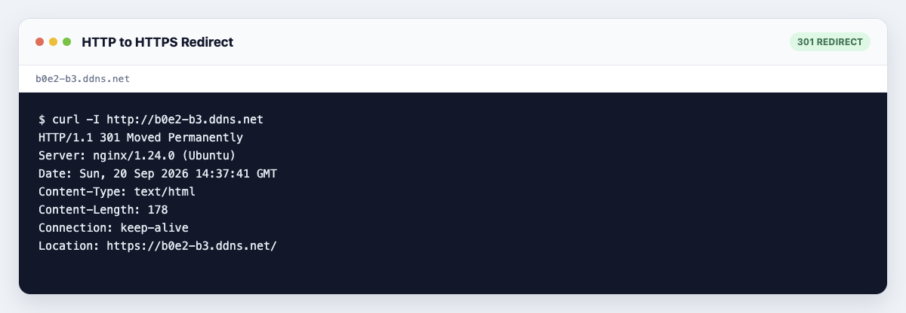
    </td>
  </tr>
  <tr>
    <td colspan="2">
      <strong>HTTPS 적용 후 컨테이너 상태</strong><br>
      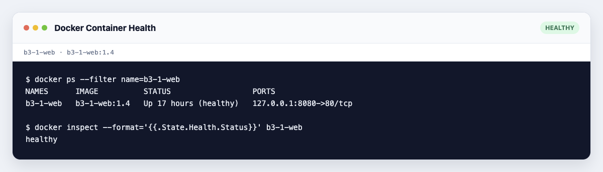
    </td>
  </tr>
</table>

### 4. 서비스 동작

#### 웹 페이지

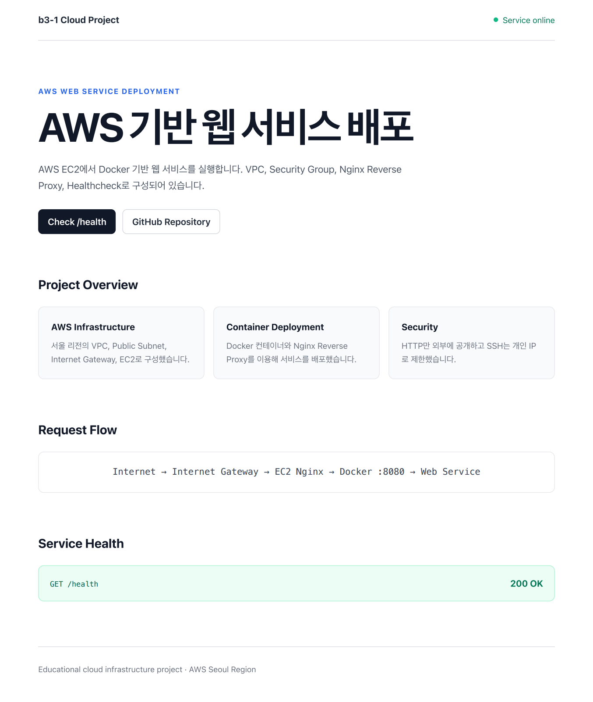

#### 상태 확인

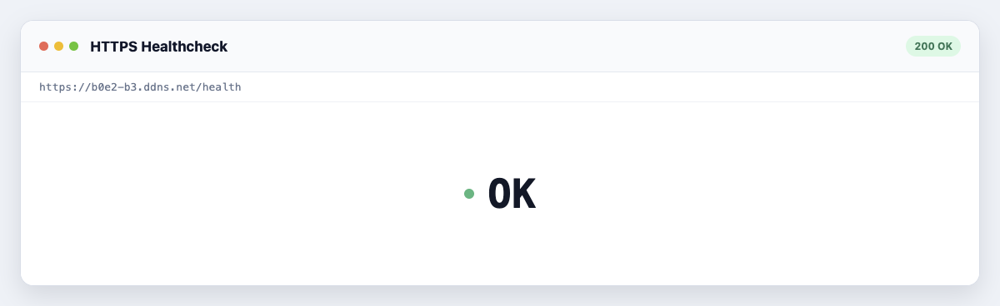

### 5. 권한과 정리

<table>
  <tr>
    <td width="50%">
      <strong>IAM 최소 권한</strong><br>
      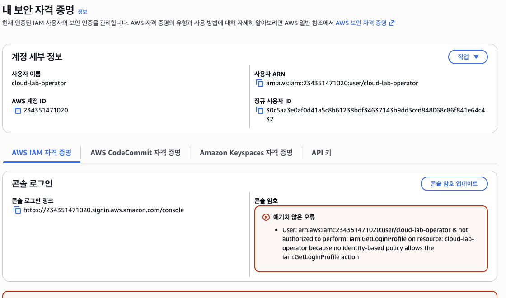
    </td>
    <td width="50%">
      <strong>인스턴스 종료</strong><br>
      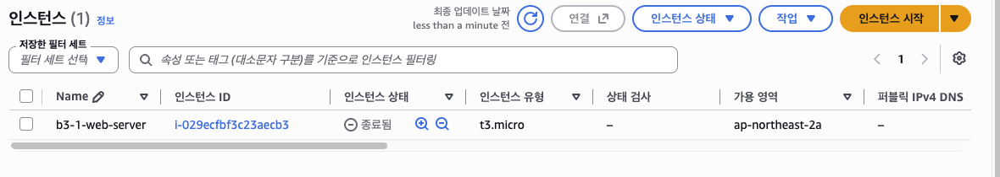
    </td>
  </tr>
  <tr>
    <td width="50%">
      <strong>VPC 삭제 확인</strong><br>
      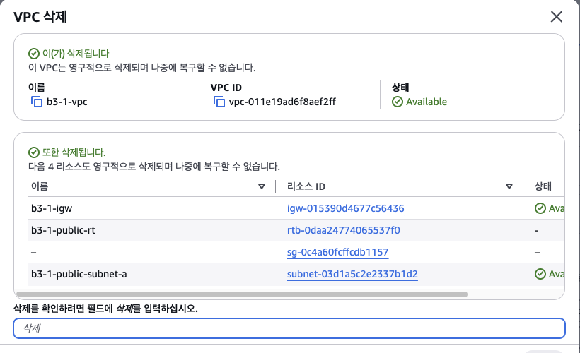
    </td>
    <td width="50%">
      <strong>VPC 삭제 결과</strong><br>
      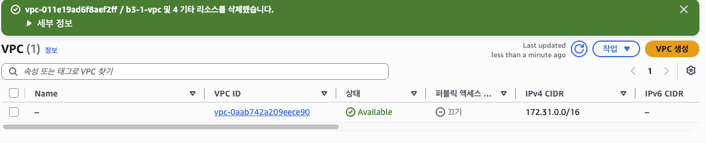
    </td>
  </tr>
</table>

삭제 절차 전체 기록은 [Cleanup Evidence](docs/cleanup-evidence.md) 에 있습니다.

## Documentation

| 문서 | 내용 |
|---|---|
| [HTTPS Setup](docs/https-setup.md) | 도메인 연결과 인증서 발급 절차 |
| [Troubleshooting](docs/troubleshooting.md) | 컨테이너 상태 점검 사례 |
| [Network Troubleshooting](docs/network-troubleshooting.md) | 외부 접속 장애 점검 순서 |
| [IAM and Least Privilege](docs/iam-least-privilege.md) | 권한 분리와 최소 권한 적용 |
| [Naming and Tagging](docs/naming-and-tagging.md) | 이름과 태그 규칙 |
| [Scaling and Cost](docs/scaling-and-cost.md) | 병목 점검, ALB 도입 기준, 비용 관리 |
| [Cleanup Checklist](docs/cleanup-checklist.md) | 리소스 정리 절차 |
| [Cleanup Evidence](docs/cleanup-evidence.md) | 삭제 수행 기록 |
