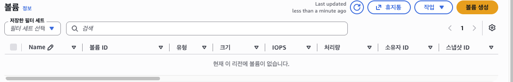

# Cleanup Evidence

리소스 삭제 절차를 실제로 수행하고 결과를 기록했습니다.

문서는 두 번의 정리를 담고 있습니다.

| 시점 | 내용 |
|---|---|
| 1차 (평가 전) | 삭제 절차를 검증하고 증빙을 확보한 뒤 동일 구성으로 재구축 |
| 2차 (평가 후) | 전체 리소스와 도메인 최종 삭제 |

## 1. 인스턴스 종료

인스턴스를 종료하고 상태가 `종료됨` 으로 바뀐 것을 확인했습니다.


## 2. EBS 볼륨 정리

루트 볼륨은 종료 시 자동 삭제되도록 설정되어 있어 별도 볼륨이 남지 않았습니다.



## 3. 네트워크 리소스 삭제

VPC 삭제 시 함께 제거되는 리소스 목록을 확인했습니다. 인터넷 게이트웨이, 라우팅 테이블, 보안 그룹, 서브넷이 포함됩니다.


## 4. 삭제 결과

VPC와 4개의 연관 리소스가 삭제되었고, 목록에는 기본 VPC만 남았습니다.


## 5. 탄력적 IP

이 구성에서는 탄력적 IP를 할당하지 않고 인스턴스의 자동 할당 공인 IP를 사용했습니다. 따라서 반환할 주소가 없습니다.

## 삭제 대상 정리

| 리소스 | 식별자 | 결과 |
|---|---|---|
| EC2 인스턴스 | `i-029ecfbf3c23aecb3` | 종료됨 |
| 루트 EBS 볼륨 | 인스턴스 연결 볼륨 | 종료 시 삭제 |
| 보안 그룹 | `b3-1-web-sg` | 삭제 |
| 서브넷 | `b3-1-public-subnet-a` | 삭제 |
| 라우팅 테이블 | `b3-1-public-rt` | 삭제 |
| 인터넷 게이트웨이 | `b3-1-igw` | 분리 후 삭제 |
| VPC | `vpc-011e19ad6f8aef2ff` | 삭제 |

## 재구축

평가를 위해 같은 구성으로 다시 생성했습니다.

| 리소스 | 값 |
|---|---|
| VPC | `10.0.0.0/16` |
| 퍼블릭 서브넷 | `10.0.1.0/24` |
| 라우팅 | `0.0.0.0/0 → IGW` |
| 보안 그룹 | 80, 443 공개, 22는 관리자 IP |
| 인스턴스 | `t3.micro`, Ubuntu 24.04 |
| 구성 자동화 | `scripts/provision.sh` |
| HTTPS | Let’s Encrypt 재발급 |

재구축 후 HTTPS, `/health`, HTTP 리디렉션, 컨테이너 상태, 인증서 자동 갱신을 모두 확인했습니다.

## 최종 정리 (2026-09-21)

평가가 끝난 뒤 남은 리소스를 모두 삭제했습니다.

| 리소스 | 식별자 | 결과 |
|---|---|---|
| EC2 인스턴스 | `i-08b77671f3023f9f9` | 종료됨 |
| 루트 EBS 볼륨 | 인스턴스 연결 볼륨 | 종료 시 삭제, 잔여 없음 |
| 보안 그룹 | `b3-1-web-sg` | 삭제 |
| 서브넷 | `10.0.1.0/24` | 삭제 |
| 라우팅 테이블 | 퍼블릭 라우팅 테이블 | 삭제 |
| 인터넷 게이트웨이 | `igw-063049724de7dcd5a` | 분리 후 삭제 |
| VPC | `vpc-08e22fe208e6cc011` | 삭제 |
| 키 페어 | `b3-1-key` | 삭제 |
| 탄력적 IP | 해당 없음 | 미사용 |
| 스냅샷 | 해당 없음 | 생성하지 않음 |
| No-IP 호스트 | `b0e2-b3.ddns.net` | 삭제 |

삭제 후 확인 결과입니다.

- 서울 리전에 실행 중인 인스턴스 없음
- EBS 볼륨, 스냅샷, 탄력적 IP 목록 비어 있음
- 사용자 생성 VPC 없음 (기본 VPC만 유지)
- No-IP 호스트 0개

## 참고

이 계정의 운영 사용자 `cloud-lab-operator` 는 최소 권한으로 구성되어 있어 CloudTrail 이벤트 조회 권한이 없습니다. 따라서 삭제 기록은 콘솔 화면 증빙으로 남겼습니다. 권한이 있는 환경에서는 다음 이벤트로 삭제 이력을 확인할 수 있습니다.

```text
TerminateInstances
DeleteSecurityGroup
DeleteSubnet
DeleteRouteTable
DetachInternetGateway
DeleteInternetGateway
DeleteVpc
```
