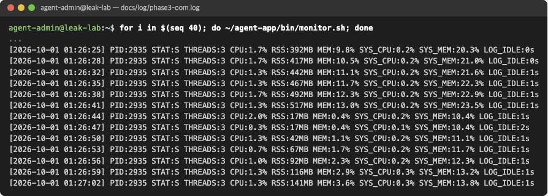

# Phase 3. 메모리 누수 (OOM)

기록: [phase3-oom.log](../log/phase3-oom.log) · 리포트: [#7](https://github.com/b0e2/b4-2/issues/7)

## 목표

- 시간에 따른 RSS 증가 관측
- MemoryGuard 강제 종료 로그 확인
- `MEMORY_LIMIT` 조정 전후 생존 시간 비교

## 진행

| 실행 | MEMORY_LIMIT | 방법 |
| --- | --- | --- |
| 1 | 256 | `.bash_profile` 수정 |
| 2 | 128 | 명령 앞 `MEMORY_LIMIT=128` |
| 3 | 512 | `.bash_profile` 수정 (조치) |

```bash
sed -i 's/^export MEMORY_LIMIT=.*/export MEMORY_LIMIT=256/' ~/.bash_profile
source ~/.bash_profile
(sleep 2; while ~/agent-app/bin/monitor.sh > /dev/null; do :; done) &
date +%T; $AGENT_HOME/agent-leak-app-arm64; echo "exit=$?"; date +%T
cat $AGENT_LOG_DIR/monitor.log
mv $AGENT_LOG_DIR/monitor.log $AGENT_LOG_DIR/monitor-256.log
```

```bash
sed -i 's/^export MEMORY_LIMIT=.*/export MEMORY_LIMIT=512/' ~/.bash_profile
source ~/.bash_profile
nohup $AGENT_HOME/agent-leak-app-arm64 > $AGENT_LOG_DIR/console.log 2>&1 &
for i in $(seq 40); do ~/agent-app/bin/monitor.sh; done
grep -E 'Reached Limit|Flushed' $AGENT_LOG_DIR/agent_app.log
ps -o pid,etime,rss,vsz,stat,cmd -p $(pgrep -n -x agent-leak-app-)
pkill -x agent-leak-app-
```

## 확인

### MEMORY_LIMIT=256


- RSS가 3초마다 약 25MB씩 증가 (41MB → 266MB)
- CPU, 스레드 수는 변화 없음
- 275MB에서 `Self-terminating process 2551`, exit 137

### MEMORY_LIMIT=512




- 525MB에서 종료 대신 `Memory Cache Flushed`, RSS 517MB → 17MB
- 이후 같은 속도로 다시 증가

## 결과

| MEMORY_LIMIT | 결과 | 생존 시간 | 종료 코드 |
| --- | --- | --- | --- |
| 128 | SELF-TERMINATED | 17초 | 137 |
| 256 | SELF-TERMINATED | 33초 | 137 |
| 512 | 계속 동작 (수동 종료) | 2분 7초 이상 | - |

한도를 올리면 종료는 피하지만 메모리 증가 자체는 그대로입니다.
