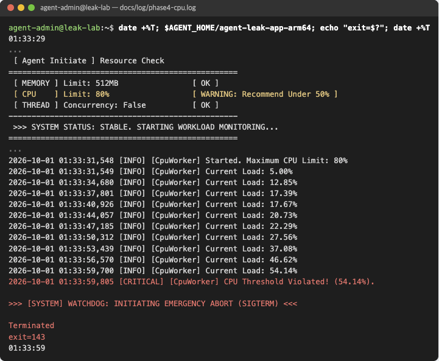
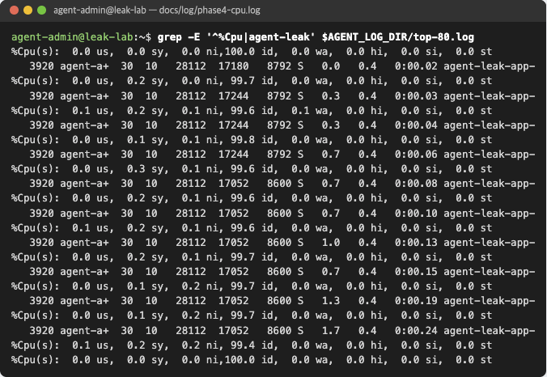
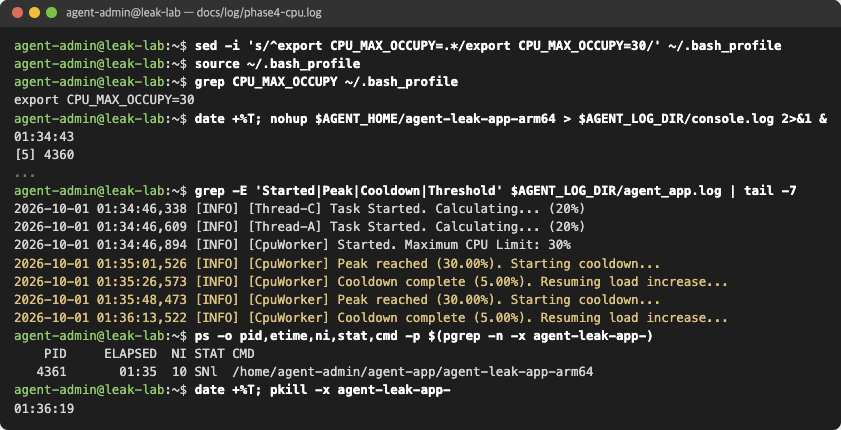
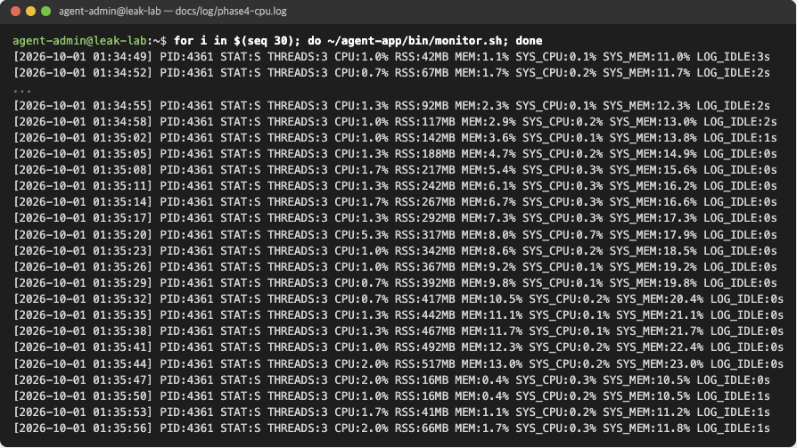

# Phase 4. CPU 과점유

기록: [phase4-cpu.log](../log/phase4-cpu.log) · 리포트: [#9](https://github.com/b0e2/b4-2/issues/9)

## 목표

- 시스템 전체가 아닌 agent-leak-app의 CPU 사용률 상승 구간 확인
- 종료가 Watchdog 보호 조치임을 로그와 종료 코드로 확인
- `CPU_MAX_OCCUPY` 조정 전후 비교

## 진행

| 실행 | CPU_MAX_OCCUPY | 방법 |
| --- | --- | --- |
| 1 | 80 | `.bash_profile` 수정 |
| 2 | 100 | 명령 앞 `CPU_MAX_OCCUPY=100` |
| 3 | 30 | `.bash_profile` 수정 (조치) |

```bash
sed -i 's/^export CPU_MAX_OCCUPY=.*/export CPU_MAX_OCCUPY=80/' ~/.bash_profile
source ~/.bash_profile
(sleep 2; while ~/agent-app/bin/monitor.sh > /dev/null; do :; done) &
(sleep 2; top -b -d 3 -n 15 -p $(pgrep -n -x agent-leak-app-) > $AGENT_LOG_DIR/top-80.log) &
date +%T; $AGENT_HOME/agent-leak-app-arm64; echo "exit=$?"; date +%T
cat $AGENT_LOG_DIR/monitor.log
grep -E '^%Cpu|agent-leak' $AGENT_LOG_DIR/top-80.log
```

```bash
sed -i 's/^export CPU_MAX_OCCUPY=.*/export CPU_MAX_OCCUPY=30/' ~/.bash_profile
source ~/.bash_profile
nohup $AGENT_HOME/agent-leak-app-arm64 > $AGENT_LOG_DIR/console.log 2>&1 &
for i in $(seq 30); do ~/agent-app/bin/monitor.sh; done
grep -E 'Started|Peak|Cooldown|Threshold' $AGENT_LOG_DIR/agent_app.log | tail -7
pkill -x agent-leak-app-
```

## 확인

### CPU_MAX_OCCUPY=80






- 앱 `Current Load` 5% → 54%, 프로세스 CPU 0.3% → 1.7%
- 시스템 idle은 99.6~99.8%로 변화 없음
- Load 54.14%에서 `CPU Threshold Violated!` → `WATCHDOG ... (SIGTERM)`, exit 143

측정값이 작은 이유: 부하 작업이 약 3.1초마다 0.1초 동안만 실행됩니다. 54% × 0.1초 / 3.1초 ≈ 1.7%로 측정값과 같습니다.

### CPU_MAX_OCCUPY=30





- 30%에서 `Peak reached` → 5%까지 cooldown → 다시 증가를 반복
- Watchdog 종료 없음

## 결과

| CPU_MAX_OCCUPY | 최고 Load | 결과 | 생존 시간 | 종료 코드 |
| --- | --- | --- | --- | --- |
| 100 | 51.63% | WATCHDOG SIGTERM | 28초 | 143 |
| 80 | 54.14% | WATCHDOG SIGTERM | 30초 | 143 |
| 30 | 30.00% | 계속 동작 (수동 종료) | 1분 36초 이상 | - |

80, 100 모두 50%를 넘는 첫 기록에서 종료되었습니다. `CPU_MAX_OCCUPY`는 부하 상한이고, Watchdog 기준은 약 50%로 따로 있습니다.
