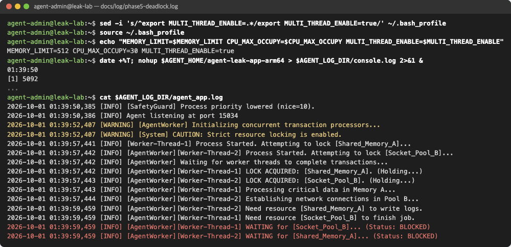
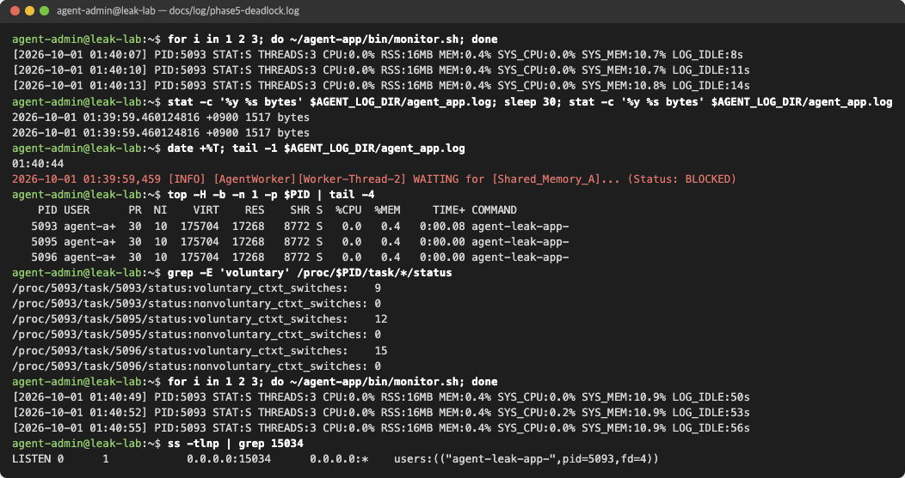

# Phase 5. 교착상태 (Deadlock)

기록: [phase5-deadlock.log](../log/phase5-deadlock.log) · 리포트: [#11](https://github.com/b0e2/b4-2/issues/11)

## 목표

- PID는 유지되지만 CPU, 메모리, 로그가 멈춘 상태 확인
- 마지막 로그로 스레드 간 자원 대기 관계 확인
- `MULTI_THREAD_ENABLE` 조정 전후 비교

## 진행

```bash
sed -i 's/^export MULTI_THREAD_ENABLE=.*/export MULTI_THREAD_ENABLE=true/' ~/.bash_profile
source ~/.bash_profile
nohup $AGENT_HOME/agent-leak-app-arm64 > $AGENT_LOG_DIR/console.log 2>&1 &
sleep 10
ps -ef | grep agent-leak | grep -v grep
PID=$(pgrep -n -x agent-leak-app-)
cat $AGENT_LOG_DIR/agent_app.log
ps -L -o pid,lwp,stat,pcpu,wchan:20,comm -p $PID
top -H -b -n 1 -p $PID | tail -4
grep -E 'voluntary' /proc/$PID/task/*/status
for i in 1 2 3; do ~/agent-app/bin/monitor.sh; done
stat -c '%y %s bytes' $AGENT_LOG_DIR/agent_app.log; sleep 30; stat -c '%y %s bytes' $AGENT_LOG_DIR/agent_app.log
ss -tlnp | grep 15034
pkill -x agent-leak-app-
```

```bash
sed -i 's/^export MULTI_THREAD_ENABLE=.*/export MULTI_THREAD_ENABLE=false/' ~/.bash_profile
source ~/.bash_profile
nohup $AGENT_HOME/agent-leak-app-arm64 > $AGENT_LOG_DIR/console.log 2>&1 &
grep -cE 'WAITING|BLOCKED' $AGENT_LOG_DIR/agent_app.log
ps -L -o pid,lwp,stat,pcpu,wchan:20,comm -p $PID
pkill -x agent-leak-app-
```

## 확인

### MULTI_THREAD_ENABLE=true



| 스레드 | 보유 | 대기 |
| --- | --- | --- |
| Worker-Thread-1 | Shared_Memory_A | Socket_Pool_B |
| Worker-Thread-2 | Socket_Pool_B | Shared_Memory_A |


- PID 5092, 5093 유지
- 스레드 3개 모두 `futex_wait` (락 대기), CPU 0.0%



- `top -H`의 TIME+, RES와 스레드별 문맥 교환 횟수가 40초 동안 같음
- `agent_app.log` 수정 시각과 크기(1517 bytes)가 30초 동안 같음
- `LOG_IDLE` 8초 → 56초, 15034 포트는 계속 LISTEN

### MULTI_THREAD_ENABLE=false


- `pkill` 후 프로세스 정리 확인 (`no process`)
- `WAITING`, `BLOCKED` 0건, `[Scheduler] All tasks completed.`
- 워커 스레드 `do_select`, CPU 1.0~1.7%, `LOG_IDLE` 1초

## 결과

| 항목 | true | false |
| --- | --- | --- |
| 로그 | `WAITING ... BLOCKED` 이후 정지 | 계속 기록 |
| 스레드 | 모두 `futex_wait` | 워커 `do_select` |
| CPU | 0.0% 고정 | 1.0~1.7% |
| LOG_IDLE | 8s → 56s | 1s |
