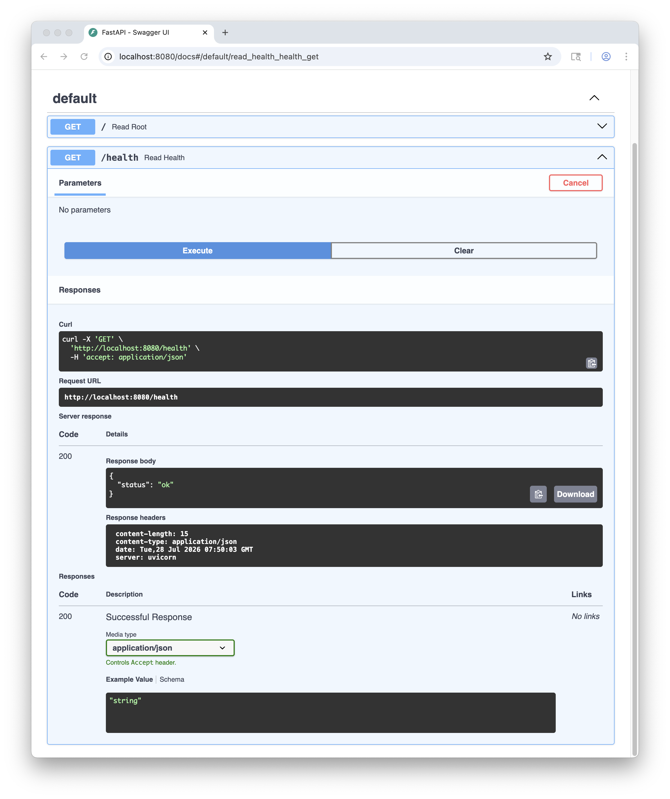
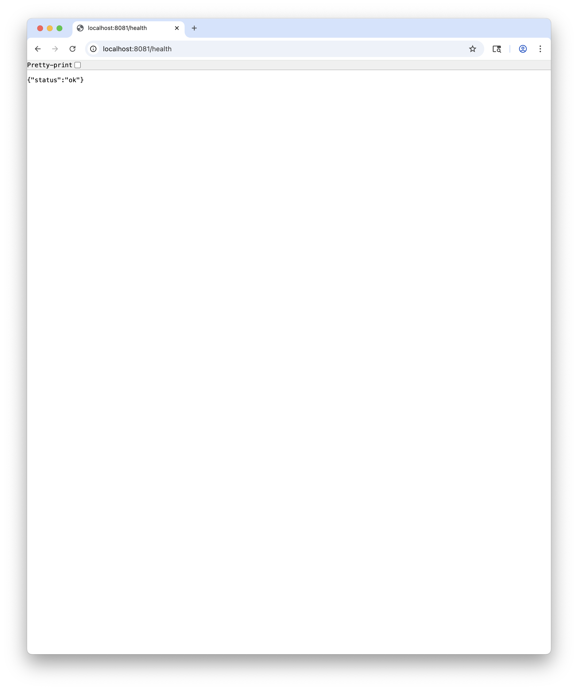

# Docker Development Workstation

<p align="center">
  <b>터미널부터 Docker Compose까지 직접 구성한 개발 환경 실습</b><br/>
  FastAPI와 Redis 서비스를 컨테이너로 실행하며 이미지, 네트워크, 볼륨과 운영 명령을 검증한 프로젝트
</p>

<p align="center">
  
  
  
  
  
</p>

---

## Overview

이 프로젝트는 로컬 개발 환경을 직접 구성하며 터미널, 파일 권한, Git, Docker와 Docker Compose의 동작을 확인한 실습 기록입니다.

FastAPI 웹 서비스와 Redis를 예제 애플리케이션으로 사용해 컨테이너 이미지 빌드, 포트 연결, 볼륨, 서비스 간 통신과 운영 명령을 단계별로 검증했습니다. 실행 결과는 Markdown 문서와 원본 터미널 로그로 함께 남겼습니다.

## Problem

개발 도구를 설치하는 것만으로는 실제 동작 원리를 이해하기 어렵습니다.

- 이미지와 컨테이너의 차이가 명확하지 않음
- 컨테이너 내부 포트가 호스트에서 바로 열리는 것으로 오해하기 쉬움
- bind mount와 Docker volume의 사용 목적이 섞이기 쉬움
- `docker exec`와 `docker attach`의 종료 동작이 다름
- 여러 서비스를 수동 명령으로 실행하면 환경을 재현하기 어려움
- 성공 결과만 기록하면 오류 원인과 해결 과정을 다시 확인하기 어려움

## Solution

- 명령을 직접 실행하고 입력과 출력을 세션 로그로 저장
- Ubuntu 기반 이미지를 직접 구성해 Python 실행 환경 설치 과정 확인
- 비루트 사용자와 health check를 포함한 Dockerfile 작성
- FastAPI와 Redis를 Compose 서비스로 분리
- Compose 서비스 이름을 내부 DNS 주소로 사용
- 실패한 명령과 해결 과정도 별도의 트러블슈팅 문서로 기록

## Core Features

- 터미널 파일 및 디렉터리 명령 실습
- Unix 파일 권한과 `chmod` 검증
- Docker 이미지와 컨테이너 생명주기 확인
- 사용자 정의 Docker 이미지 빌드
- 호스트와 컨테이너 포트 매핑
- bind mount와 named volume 비교
- 볼륨 백업과 복구
- `docker exec`와 `docker attach` 차이 검증
- Docker Compose 기반 FastAPI와 Redis 실행
- GitHub HTTPS 및 SSH 인증 구성
- 실습별 Markdown 문서와 원본 터미널 로그 보관

## Application

예제 애플리케이션은 FastAPI 웹 서비스와 Redis로 구성됩니다.

| 경로 | 동작 |
| --- | --- |
| `GET /` | Redis의 `visit_count`를 증가시키고 현재 값을 반환 |
| `GET /health` | 컨테이너 상태 확인용 `{"status":"ok"}` 반환 |
| `GET /docs` | FastAPI가 제공하는 OpenAPI 문서 |

```json
{"message":"Hello","visit_count":1}
```

요청을 반복하면 Redis에 저장된 방문 횟수가 증가합니다.

## Architecture

```text
e1-1/
├── app/
│   ├── main.py              FastAPI 엔드포인트와 Redis 연결
│   ├── requirements.txt     Python 패키지 버전
│   ├── Dockerfile           Ubuntu 기반 웹 이미지
│   └── docker-compose.yml   web과 redis 서비스 구성
├── test/
│   ├── box/                 터미널 파일 명령 실습
│   ├── perm/                파일 권한 실습
│   └── bind-test/           bind mount 동작 확인
└── docs/
    ├── md/                  단계별 실습과 트러블슈팅 문서
    ├── logs/                원본 터미널 세션
    └── assets/              브라우저와 VS Code 스크린샷
```

Dockerfile은 `ubuntu:22.04`에서 Python과 pip를 직접 설치합니다. 애플리케이션은 비루트 사용자인 `appuser`로 실행되며 `/health`를 사용한 health check를 포함합니다.

## Data Flow

```text
[브라우저 또는 curl]
        │ localhost:8080
        ▼
Docker 포트 매핑 8080:8000
        │
        ▼
web 컨테이너
Uvicorn → FastAPI
        │ REDIS_HOST=redis
        ▼
Compose 내부 네트워크와 서비스 DNS
        │
        ▼
redis 컨테이너
visit_count 증가
        │
        ▼
JSON 응답 반환
```

호스트에서는 `localhost:8080`으로 접근하지만, 웹 컨테이너는 Compose 서비스 이름인 `redis`를 주소로 사용합니다.

## Docker Compose

```yaml
services:
  web:
    build: .
    ports:
      - "8080:8000"
    environment:
      - APP_ENV=production
      - REDIS_HOST=redis
    depends_on:
      - redis

  redis:
    image: redis:7-alpine
```

`depends_on`은 Redis 컨테이너를 먼저 시작하도록 순서를 정하지만, 애플리케이션 수준의 준비 완료까지 보장하지는 않습니다.

## Technical Highlights

| Area | Decision | Impact |
| --- | --- | --- |
| Base Image | `ubuntu:22.04`에서 Python을 직접 설치 | 런타임 도구가 이미지에 추가되는 과정 확인 |
| Container User | `appuser` 비루트 사용자로 실행 | 애플리케이션의 root 권한 사용 방지 |
| Health Check | `/health`를 주기적으로 호출 | 프로세스 실행 여부가 아닌 서비스 응답 상태 확인 |
| Service Discovery | Redis 주소로 Compose 서비스 이름 사용 | IP를 직접 관리하지 않고 내부 DNS로 연결 |
| Port Mapping | 호스트 8080을 컨테이너 8000에 연결 | 네트워크 네임스페이스 분리와 외부 노출 확인 |
| Persistence Practice | bind mount와 named volume을 각각 실습 | 소스 공유와 데이터 보존 목적을 구분 |
| Reproducibility | Compose 파일에 서비스 구성을 선언 | 동일한 웹과 Redis 환경을 한 명령으로 재현 |
| Documentation | 가공 문서와 원본 세션 로그를 함께 보관 | 결과뿐 아니라 실행 과정도 다시 검증 가능 |

## Concepts

### Image and Container

이미지는 읽기 전용 레이어의 묶음이고, 컨테이너는 이미지 위에 쓰기 가능한 레이어를 추가한 실행 인스턴스입니다. 실행 중인 컨테이너에 만든 파일은 새 컨테이너를 생성할 때 유지되지 않습니다.

### Bind Mount and Volume

| 방식 | 적합한 용도 |
| --- | --- |
| bind mount | 호스트 소스 파일을 컨테이너와 실시간으로 공유 |
| named volume | Docker가 관리하는 애플리케이션 데이터 보존 |

### `exec` and `attach`

- `docker exec`는 실행 중인 컨테이너 안에 별도 프로세스를 만듭니다.
- `docker attach`는 컨테이너의 메인 프로세스에 직접 연결합니다.
- attach 상태에서 메인 프로세스를 종료하면 컨테이너도 함께 종료될 수 있습니다.

## Running Locally

Docker Desktop 또는 OrbStack처럼 Docker 데몬을 제공하는 환경이 필요합니다.

```bash
git clone https://github.com/b0e2/codyssey.git
cd codyssey/e1-1/app

docker compose up -d --build
```

동작을 확인합니다.

```bash
curl http://localhost:8080/health
curl http://localhost:8080
curl http://localhost:8080
```

상태와 로그를 확인하고 종료합니다.

```bash
docker compose ps
docker compose logs web
docker compose logs redis
docker compose down
```

### Dockerfile만 실행

```bash
docker build -t my-web:1.0 .
docker run -d -p 8080:8000 --name my-web-8080 my-web:1.0
curl http://localhost:8080/health
docker rm -f my-web-8080
```

## Verification

이 프로젝트에는 자동화된 단위 테스트가 없습니다. 각 단계의 명령과 실제 출력은 `docs/md/`와 `docs/logs/`에 기록되어 있습니다.

| 영역 | 문서 |
| --- | --- |
| 터미널 명령 | `docs/md/01-terminal-session.md` |
| 파일 권한 | `docs/md/02-terminal-permissions.md` |
| Docker 환경 | `docs/md/03-docker-basic-session.md` |
| 컨테이너 실행 | `docs/md/04-docker-run-session.md` |
| 이미지와 포트 | `docs/md/05-docker-build-session.md` |
| 볼륨과 백업 | `docs/md/06-volume-session.md` |
| Git과 GitHub | `docs/md/07-git-setup-session.md` |
| Compose 단일 서비스 | `docs/md/08-compose-single-clean-session.md` |
| Compose 다중 서비스 | `docs/md/09-compose-multi-session.md` |
| Compose 운영 | `docs/md/10-compose-ops-session.md` |
| SSH 인증 | `docs/md/11-ssh-key.md` |
| exec와 attach | `docs/md/attach-exec-session.md` |
| 오류와 해결 | `docs/md/troubleshooting.md` |

Compose 설정은 다음 명령으로 확인할 수 있습니다.

```bash
docker compose config
```

## Screens

| API 문서 | Health Check |
| --- | --- |
|  |  |


## Troubleshooting

| Issue | Approach | Result |
| --- | --- | --- |
| 호스트 포트가 이미 사용 중 | `lsof -nP -i :8080`으로 프로세스 확인 후 다른 호스트 포트 사용 | 컨테이너 내부 포트는 유지한 채 충돌 해결 |
| Redis 연결 코드 오타로 web 재시작 반복 | `docker compose logs web`에서 traceback 확인 | `decode_responses`로 수정 후 정상 연결 |
| 사용 중인 volume 삭제 실패 | 해당 volume을 참조하는 컨테이너를 먼저 제거 | volume 삭제와 복구 실습 완료 |
| 터미널 녹화 로그에 제어 문자가 포함됨 | 셸 테마와 자동 제안이 없는 환경에서 다시 기록 | 읽을 수 있는 원본 세션 확보 |

## Known Limitations

- Redis 영속 볼륨이 없어 컨테이너를 다시 생성하면 방문 횟수가 초기화됩니다.
- `depends_on`만 사용하므로 Redis 준비 상태를 확인하는 재시도 로직은 없습니다.
- 기본 포트 매핑은 모든 네트워크 인터페이스에 열릴 수 있습니다. 로컬 전용이면 `127.0.0.1:8080:8000`을 사용해야 합니다.
- 자동화된 테스트와 CI는 없으며 문서화된 수동 검증을 사용합니다.
- `test/` 폴더는 애플리케이션 테스트가 아니라 터미널, 권한과 mount 실습 파일입니다.

## Roadmap

- Redis 데이터 영속 volume 추가
- Redis health check와 web 시작 조건 구성
- Compose smoke test 자동화
- 이미지 크기와 build cache 비교
- GitHub Actions에서 Docker 이미지 빌드 검증
