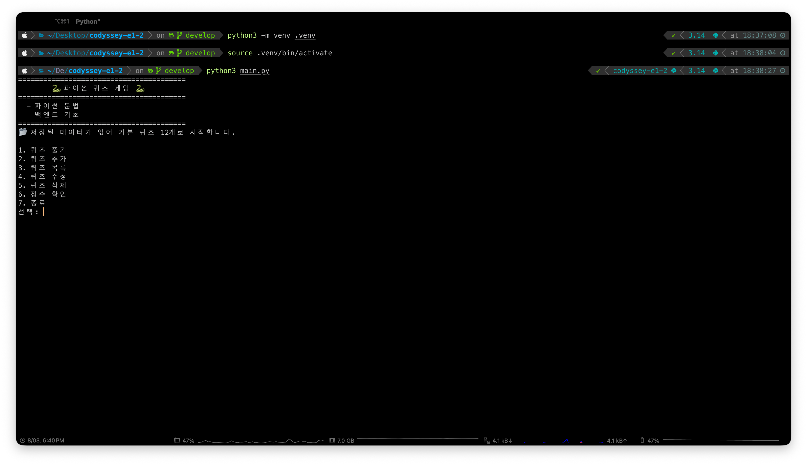
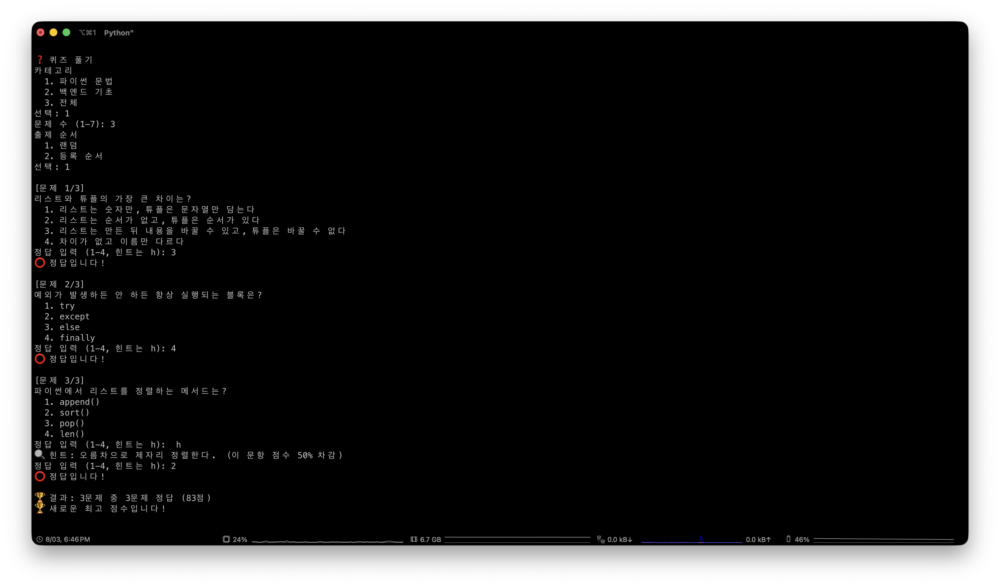
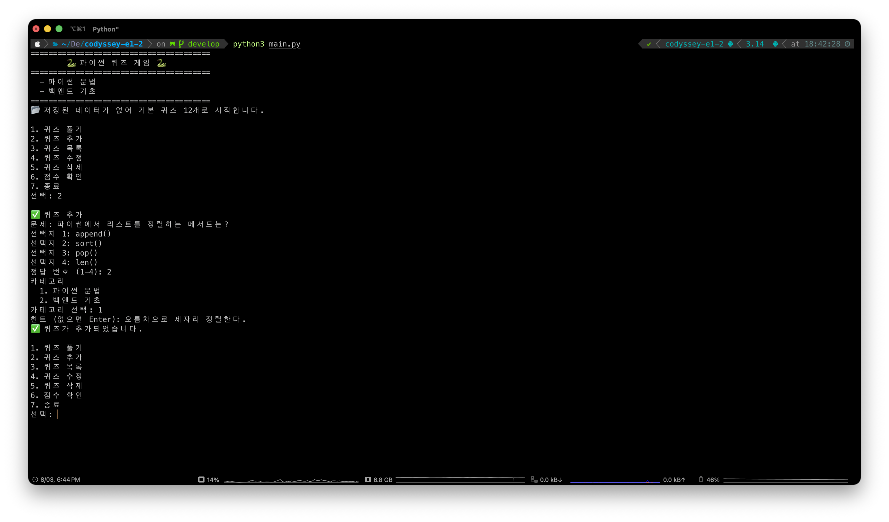
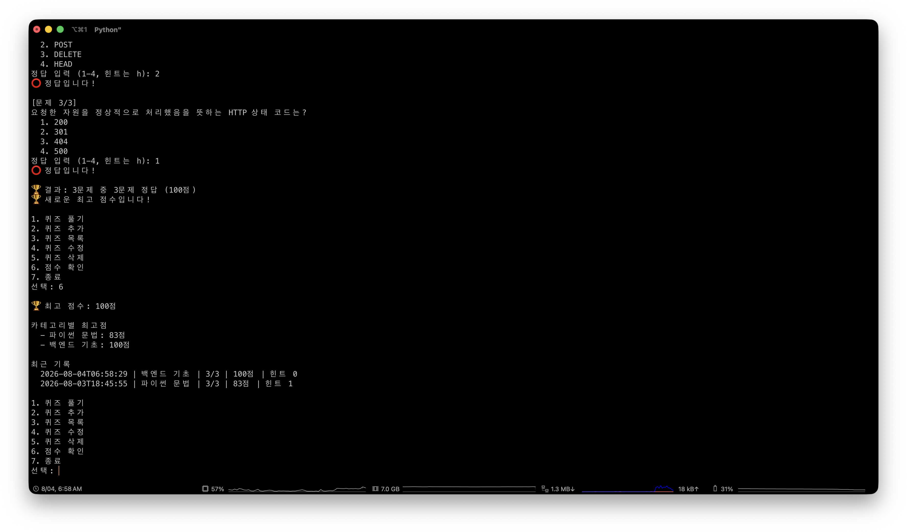

# Python Quiz Game

<p align="center">
  <b>파이썬 문법과 백엔드 기초를 학습하는 콘솔 퀴즈 게임</b><br/>
  문제 관리부터 힌트, 점수 기록과 안전한 JSON 저장까지 구현한 표준 라이브러리 기반 애플리케이션
</p>

<p align="center">
  
  
  
  
</p>

---

## Overview

Python Quiz Game은 파이썬 문법과 백엔드 기초 문제를 풀고 직접 관리할 수 있는 콘솔 애플리케이션입니다.

문제와 최고 점수, 카테고리별 기록을 하나의 JSON 파일에 저장합니다. 외부 패키지 없이도 입력 검증, 안전 종료, 원자적 파일 교체와 손상 데이터 복구를 경험하는 데 집중했습니다.

## Problem

단순한 퀴즈 프로그램도 기록과 편집 기능이 추가되면 여러 문제를 해결해야 합니다.

- 프로그램을 종료한 뒤에도 문제와 점수를 유지해야 함
- 파일 저장 도중 중단되면 JSON이 손상될 수 있음
- 서로 다른 문제 수로 플레이하면 점수를 직접 비교하기 어려움
- 여러 주제를 섞으면 어떤 영역이 부족한지 알기 어려움
- 입력 도중 `Ctrl+C`나 EOF가 발생해도 데이터를 저장해야 함
- 잘못된 저장 데이터가 애플리케이션 전체를 중단시킬 수 있음

## Solution

- 상태를 `state.json` 한 파일에 저장
- 임시 파일에 먼저 쓴 뒤 `os.replace`로 원본 교체
- 저장 파일이 없거나 손상되면 기본 문제 데이터로 복구
- 문제 수와 관계없이 결과를 100점 기준으로 환산
- Python과 Backend 카테고리의 최고 점수를 별도 관리
- `KeyboardInterrupt`와 `EOFError`를 안전 종료 흐름으로 변환
- 모델 복원 단계에서 타입, 범위와 필수 값을 검증

## Core Features

- Python, Backend 또는 전체 카테고리 퀴즈 플레이
- 출제 문제 수와 랜덤 순서 선택
- 힌트 사용과 해당 문제 점수 50% 차감
- 문제 추가, 목록, 수정, 삭제
- 전체 최고 점수와 카테고리별 최고 점수 관리
- 최근 플레이 기록 조회
- 첫 실행 시 기본 문제 자동 구성
- JSON 저장과 손상 데이터 복구
- `Ctrl+C`와 EOF 입력 시 안전 저장 후 종료

## Menu

| 번호 | 기능 | 설명 |
| --- | --- | --- |
| `1` | 퀴즈 풀기 | 카테고리, 문제 수와 출제 순서를 선택해 플레이 |
| `2` | 퀴즈 추가 | 문제, 선택지, 정답, 카테고리와 힌트 등록 |
| `3` | 퀴즈 목록 | 문제를 카테고리별로 출력 |
| `4` | 퀴즈 수정 | 선택한 문제의 필요한 항목만 변경 |
| `5` | 퀴즈 삭제 | 확인 후 선택한 문제 제거 |
| `6` | 점수 확인 | 전체, 카테고리별 최고점과 최근 기록 출력 |
| `7` | 종료 | 현재 상태를 저장하고 프로그램 종료 |

## Quiz Rules

### Categories

| 값 | 내용 |
| --- | --- |
| `python` | 자료형, 제어문, 함수, 클래스, 예외와 파일 입출력 |
| `backend` | HTTP, REST, JSON, 데이터베이스와 FastAPI 기초 |
| 전체 | 두 카테고리에서 함께 출제 |

### Scoring

문제 하나의 기본 배점은 `100 / 전체 문제 수`입니다. 문제 수를 다르게 선택해도 최종 결과는 항상 100점 만점으로 비교할 수 있습니다.

힌트를 사용한 문제는 정답이어도 해당 배점의 50%만 얻습니다. 전체 카테고리 플레이 결과는 전체 최고점에만 반영되고 개별 카테고리 최고점에는 포함되지 않습니다.

### Input

- 신규 값에서 빈 입력은 잘못된 입력으로 처리합니다.
- 수정 화면에서 빈 입력은 기존 값 유지를 의미합니다.
- 답변 입력 중 `h`를 사용하면 힌트를 확인할 수 있습니다.
- `Ctrl+C` 또는 EOF가 발생하면 현재 상태를 저장하고 종료합니다.

## Screens

| 메뉴 | 퀴즈 플레이 |
| --- | --- |
|  |  |

| 퀴즈 추가 | 점수 확인 |
| --- | --- |
|  |  |

개발 환경과 커밋 그래프는 `docs/screenshots/devenv.png`, `docs/screenshots/gitlog.png`에서 확인할 수 있습니다.

## Data

애플리케이션 상태는 프로젝트 루트의 `state.json`에 저장됩니다. 이 파일과 임시 저장 파일은 Git 추적 대상에서 제외됩니다.

```json
{
  "quizzes": [
    {
      "question": "리스트와 튜플의 가장 큰 차이는?",
      "choices": ["...", "...", "...", "..."],
      "answer": 3,
      "hint": "하나는 만든 뒤에 내용을 바꿀 수 없다",
      "category": "python"
    }
  ],
  "best_score": 100,
  "best_by_category": {
    "python": 80,
    "backend": 100
  },
  "history": [
    {
      "played_at": "2026-07-31T21:40:12",
      "category": "python",
      "total": 5,
      "correct": 4,
      "score": 80,
      "hints_used": 1
    }
  ]
}
```

| 키 | 설명 |
| --- | --- |
| `quizzes` | 문제, 선택지 4개, 정답, 힌트와 카테고리 |
| `best_score` | 모든 플레이 중 가장 높은 점수 |
| `best_by_category` | Python과 Backend 각각의 최고 점수 |
| `history` | 최근 플레이 기록, 최대 50개 보관 |

## Architecture

```text
e1-2/
├── main.py                 애플리케이션 진입점
├── pyproject.toml          프로젝트 메타데이터
├── app/
│   ├── constants.py       경로, 카테고리와 점수 규칙
│   ├── game.py            메뉴 루프와 기능 조립
│   ├── models/
│   │   ├── quiz.py        문제 모델과 데이터 검증
│   │   └── score.py       점수 기록과 최고점 모델
│   ├── features/
│   │   ├── play.py        출제, 힌트와 채점
│   │   ├── catalog.py     문제 추가, 수정, 삭제와 분류
│   │   └── score.py       플레이 기록과 최고점 갱신
│   ├── storage/
│   │   ├── repository.py  JSON 읽기, 저장과 복구
│   │   └── defaults.py    기본 퀴즈 데이터
│   └── cli/
│       ├── prompts.py     입력 검증과 안전 종료
│       └── views.py       화면 문자열 생성
└── docs/screenshots/      실행 화면
```

모델은 다른 계층을 모르고, 기능 계층은 모델을 사용합니다. CLI는 입력과 출력만 담당하며 `game.py`가 저장소와 기능을 조립하고 저장 시점을 결정합니다.

## Data Flow

```text
[메뉴 선택과 사용자 입력]
          │
          ▼
CLI 입력 검증
prompts.py
          │
          ▼
기능 로직
play · catalog · score
          │
          ▼
Quiz와 ScoreBoard 메모리 상태 변경
          │
          ▼
QuizGame.save()
          │
          ▼
state.json.tmp 작성
          │
          ▼
os.replace로 state.json 교체
```

시작할 때 저장 파일이 없으면 기본 문제를 사용합니다. 파일의 JSON 문법이나 데이터 형식이 잘못되면 기본 상태로 복구합니다.

## Technical Highlights

| Area | Decision | Impact |
| --- | --- | --- |
| Atomic Save | 임시 JSON 작성 후 `os.replace` | 저장 중 중단돼도 기존 파일 유지 |
| Model Validation | JSON 복원 시 타입과 값 범위 검사 | 문법은 맞지만 잘못된 데이터도 감지 |
| Score Normalization | 문제 수와 무관하게 100점 기준 계산 | 서로 다른 플레이 결과 비교 가능 |
| Category Score | 전체와 카테고리별 최고점을 분리 | 학습 영역별 성과 확인 |
| Safe Exit | 입력 예외를 `ExitRequested`로 변환 | 종료 요청에도 현재 상태 저장 |
| Pure Features | 출제와 점수 계산을 입출력에서 분리 | 도메인 로직의 재사용과 검증 용이 |
| View Functions | 출력 문자열 생성을 별도 모듈로 분리 | 게임 흐름과 표현 코드의 혼합 방지 |
| Dependencies | Python 표준 라이브러리만 사용 | 별도 설치 없이 실행 |

## Running Locally

```bash
git clone https://github.com/b0e2/codyssey.git
cd codyssey/e1-2

python3 main.py
```

Python 3.10 이상만 있으면 별도의 패키지 설치 없이 실행할 수 있습니다. 첫 실행에서는 기본 문제로 시작하고 프로그램이 상태를 저장할 때 `state.json`이 생성됩니다.

선택적으로 가상환경을 사용할 수 있습니다.

```bash
python3 -m venv .venv
source .venv/bin/activate
python main.py
```

## Verification

현재 자동화된 테스트 모음은 없습니다. 다음 명령으로 전체 Python 파일의 문법을 검사할 수 있습니다.

```bash
python3 -m compileall -q main.py app
```

기능 검증은 프로그램을 실행한 뒤 다음 흐름으로 진행합니다.

1. 기본 문제로 퀴즈 플레이
2. 힌트 사용 시 점수 차감 확인
3. 문제 추가, 수정과 삭제
4. 프로그램 재실행 후 상태 유지 확인
5. `Ctrl+C` 종료 후 `state.json` 저장 확인

## Known Limitations

- 저장 파일이 손상되면 기존 내용을 격리하지 않고 기본 데이터로 복구합니다.
- 여러 프로세스가 같은 `state.json`을 동시에 수정하는 상황은 지원하지 않습니다.
- 문제는 고정 ID가 아닌 목록 위치로 선택하므로 삭제 후 번호가 바뀔 수 있습니다.
- 카테고리는 Python과 Backend 두 종류로 고정되어 있습니다.
- 플레이 기록은 최근 50개까지만 유지합니다.
- 자동화된 단위 테스트와 CI가 없습니다.

## Roadmap

- 모델과 점수 계산 단위 테스트 추가
- 손상된 저장 파일의 백업과 복구 기능
- 문제별 고정 ID 도입
- 사용자 정의 카테고리 지원
- 문제와 점수 기록 내보내기
