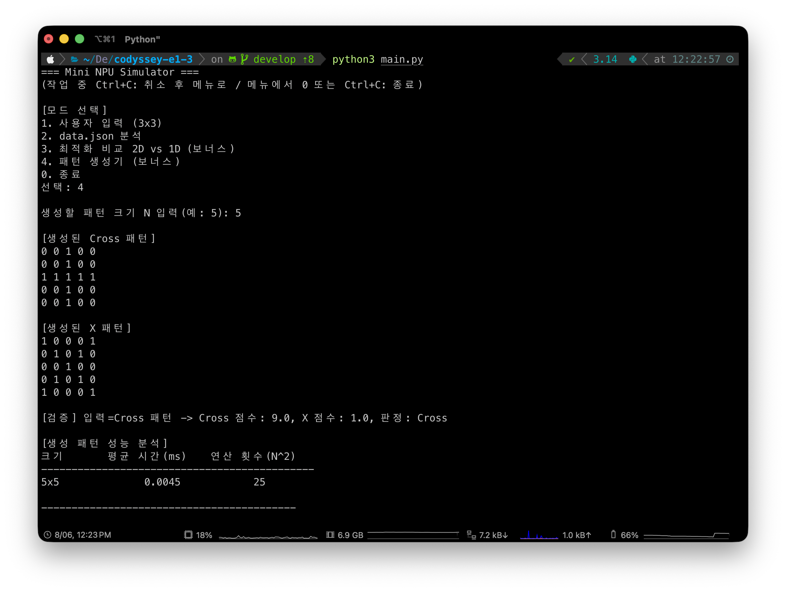

# Mini NPU Simulator

<p align="center">
  <b>MAC 연산으로 이미지 패턴을 판별하는 콘솔 시뮬레이터</b><br/>
  행렬 연산, 성능 측정과 데이터셋 분석을 순수 Python으로 구현한 NPU 학습 프로젝트
</p>

<p align="center">
  
  
  
  
</p>

---

## Overview

Mini NPU Simulator는 이미지 인식에 사용되는 MAC 연산을 순수 Python으로 구현한 콘솔 애플리케이션입니다.

입력 패턴과 Cross, X 필터의 같은 위치 값을 곱한 뒤 모두 더해 유사도 점수를 계산합니다. 두 점수를 비교해 패턴을 판별하고, 행렬 크기에 따른 실행 시간과 2차원 및 1차원 구현의 차이를 확인할 수 있습니다.

```text
□ ■ □       ■ □ ■
■ ■ ■       □ ■ □
□ ■ □       ■ □ ■
 Cross         X
```

## Problem

MAC 연산 자체는 단순하지만 실제 판별 프로그램에서는 여러 조건을 함께 다뤄야 합니다.

- 행렬 크기가 커져도 같은 연산 규칙을 적용해야 함
- 입력 데이터의 크기와 구조가 잘못되면 명확한 오류가 필요함
- 부동소수점 점수를 단순 동등 비교하면 판정이 불안정할 수 있음
- 데이터셋의 라벨 표기가 달라도 같은 의미로 정규화해야 함
- 성능 차이를 한 번의 측정값만으로 비교하기 어려움
- 사용자 입력 오류나 작업 취소가 전체 프로그램을 종료하면 안 됨

## Solution

- 행렬 생성, 접근, 평탄화와 MAC 연산을 core 계층에 집중
- Cross와 X 라벨을 표준 값으로 정규화
- `1e-9` epsilon 범위의 점수 차이는 판정 불가로 처리
- JSON 데이터셋의 필터와 패턴 크기 및 형식을 검증
- 성능 측정은 같은 연산을 10회 실행한 평균값 사용
- 작업 중 `Ctrl+C`는 현재 작업만 취소하고 메뉴로 복귀
- 2차원 중첩 반복과 1차원 평탄화 구현을 같은 입력으로 비교

## Core Features

- 3×3 필터와 입력 패턴 직접 입력
- 생성된 Cross와 X 패턴을 필터로 재사용
- `data/data.json` 데이터셋 일괄 분석
- 케이스별 PASS, FAIL과 실패 이유 출력
- 임의 크기의 Cross와 X 패턴 생성
- 2차원 MAC과 1차원 MAC 성능 비교
- 행렬 크기별 연산 횟수와 평균 실행 시간 출력
- 라벨 정규화와 epsilon 기반 동점 판정
- `Ctrl+C` 작업 취소와 EOF 안전 종료

## Modes

| 번호 | 모드 | 설명 |
| --- | --- | --- |
| `1` | 사용자 입력 | 3×3 필터 두 개와 패턴을 입력해 점수와 판정 확인 |
| `2` | 데이터셋 분석 | JSON 필터와 패턴을 읽어 일괄 판정과 결과 요약 출력 |
| `3` | 최적화 비교 | 같은 MAC 연산을 2차원과 1차원 구현으로 측정 |
| `4` | 패턴 생성기 | N×N Cross와 X 패턴을 만들고 판정 및 성능 확인 |
| `0` | 종료 | 프로그램 종료 |

종료 명령은 `0`, `q`, `quit`, `exit`, `종료`를 지원합니다.

## Usage

### Interactive Pattern

```text
[모드 선택]
1. 사용자 입력 (3x3)
2. data.json 분석
3. 최적화 비교 2D vs 1D (보너스)
4. 패턴 생성기 (보너스)
0. 종료
```

모드 1에서는 다음과 같이 행렬을 입력합니다.

```text
필터 A
0 1 0
1 1 1
0 1 0

필터 B
1 0 1
0 1 0
1 0 1

패턴
1 0 1
0 1 0
1 0 1
```

```text
A 점수: 1.0
B 점수: 5.0
판정: B
```

### Dataset Analysis

모드 2는 `data/data.json`을 읽어 모든 패턴을 분석합니다.

```text
데이터 로드
      │
      ├── 필터 정규화와 크기 검증
      ├── 패턴별 MAC 점수 계산
      ├── 기대 라벨과 판정 비교
      └── PASS, FAIL과 성능 요약 출력
```

### Pattern Generator

모드 4에서 크기 N을 입력하면 N×N Cross와 X 행렬을 생성합니다. 생성한 패턴을 다시 MAC 연산에 넣어 각 필터가 자기 패턴을 올바르게 판별하는지도 확인합니다.

## Screens

| 사용자 입력 | 데이터셋 분석 |
| --- | --- |
|  |  |

| 최적화 비교 | 패턴 생성기 |
| --- | --- |
|  |  |

## Data

`data/data.json`은 크기별 Cross, X 필터와 판정 대상 패턴을 포함합니다.

```json
{
  "filters": {
    "size_5": {
      "cross": [[0, 0, 1, 0, 0]],
      "x": [[1, 0, 0, 0, 1]]
    }
  },
  "patterns": {
    "size_5_1": {
      "input": [[0, 0, 1, 0, 0]],
      "expected": "+"
    }
  }
}
```

| 데이터 | 설명 |
| --- | --- |
| `filters.size_N.cross` | N×N Cross 기준 필터 |
| `filters.size_N.x` | N×N X 기준 필터 |
| `patterns.size_N_index.input` | 판정할 N×N 행렬 |
| `patterns.size_N_index.expected` | 기대 라벨, `+` 또는 `x` |

데이터 파일은 읽기 전용으로 사용하며 프로그램이 내용을 수정하지 않습니다. 파일 탐색 순서는 `data/data.json`, 프로젝트 루트의 `data.json`, 현재 작업 디렉터리의 `data.json`입니다.

## Architecture

```text
e1-3/
├── main.py              메뉴 출력과 모드 실행
├── pyproject.toml       프로젝트 메타데이터
├── npu/
│   ├── core.py          행렬, 라벨, MAC 연산과 판정
│   ├── patterns.py      Cross와 X 패턴 생성
│   ├── bench.py         실행 시간 측정과 비교
│   ├── dataset.py       JSON 로드, 검증과 패턴 분석
│   └── cli.py           사용자 입력, 출력과 모드 흐름
├── data/
│   └── data.json        필터와 판정 데이터셋
├── tests/
│   ├── test_core.py     행렬, MAC, 라벨과 판정 테스트
│   └── test_dataset.py  데이터 검증과 분석 테스트
└── docs/screenshots/    모드별 실행 화면
```

의존 방향은 다음과 같습니다.

```text
core ← patterns · bench · dataset ← cli ← main
```

`core.py`는 내부 모듈에 의존하지 않습니다. CLI는 계산을 직접 구현하지 않고 core, dataset, patterns와 bench의 기능을 조립합니다.

## Data Flow

```text
[메뉴 선택]
     │
     ▼
main.py
     │ 모드 실행
     ▼
npu.cli
     │
     ├── 사용자 입력 또는 data.json 로드
     ├── 행렬과 라벨 검증
     ▼
npu.core
MAC 점수 계산과 판정
     │
     ├── npu.bench 성능 측정
     └── 기대 라벨과 비교
     ▼
점수, 판정, PASS/FAIL과 요약 출력
```

## MAC Calculation

필터 `F`와 입력 패턴 `P`의 MAC 점수는 같은 위치의 값을 곱해 모두 더한 값입니다.

```text
score = Σ F[row][column] × P[row][column]
```

N×N 행렬은 모든 셀을 한 번씩 확인하므로 시간 복잡도는 `O(N²)`입니다.

점수 차이가 `1e-9` 이하이면 부동소수점 오차 범위로 보고 `UNDECIDED`를 반환합니다.

## Technical Highlights

| Area | Decision | Impact |
| --- | --- | --- |
| Matrix API | 행렬 생성과 접근을 core 함수로 통일 | 계산 코드가 저장 표현에 직접 의존하지 않음 |
| MAC Engines | 2D 중첩 반복과 1D 평탄화 구현 제공 | 같은 연산의 인덱싱 비용 비교 가능 |
| Epsilon Judge | 작은 점수 차이를 동점으로 처리 | 부동소수점 오차로 인한 불안정한 판정 방지 |
| Label Normalize | `+`, `cross`, `x`를 표준 라벨로 변환 | 데이터 표기와 내부 판정 분리 |
| Schema Validation | 필터와 패턴의 크기 및 타입 검사 | 잘못된 데이터의 위치와 원인 확인 가능 |
| Average Benchmark | 10회 실행 평균 사용 | 단일 측정의 일시적인 흔들림 완화 |
| Operation Cancel | 작업 중 `Ctrl+C`를 현재 모드 취소로 처리 | 전체 프로그램을 종료하지 않고 메뉴 복귀 |
| Dependencies | Python 표준 라이브러리만 사용 | NumPy 없이 MAC 원리와 비용을 직접 확인 |

## Running Locally

```bash
git clone https://github.com/b0e2/codyssey.git
cd codyssey/e1/e1-3

python3 main.py
```

Python 3.8 이상이면 별도의 패키지 설치 없이 실행할 수 있습니다.

## Testing

```bash
python3 -m unittest discover -s tests
```

행렬 생성과 접근, MAC 계산, 라벨 정규화, epsilon 판정, 데이터셋 스키마와 실제 `data.json` 분석을 포함한 27개의 테스트가 있습니다.

현재 데이터셋의 검증 결과는 총 6개 중 PASS 3개, FAIL 3개입니다. FAIL 3개는 입력 오류가 아니라 두 필터의 점수 차이가 epsilon보다 작은 `UNDECIDED` 케이스입니다.

## Performance

연산량은 행렬 크기의 제곱에 비례합니다.

| 크기 | 셀 수 | 상대 연산량 |
| --- | ---: | ---: |
| 3×3 | 9 | 1배 |
| 5×5 | 25 | 약 2.8배 |
| 13×13 | 169 | 약 18.8배 |
| 25×25 | 625 | 약 69.4배 |
| 1000×1000 | 1,000,000 | 약 111,111배 |

1차원 구현은 행과 열을 두 번 인덱싱하지 않아 현재 Python 구현에서는 2차원 방식보다 빠르게 측정됩니다. 두 방식 모두 모든 값을 읽으므로 시간 복잡도 자체는 `O(N²)`로 같습니다.

## Known Limitations

- Cross와 X 두 라벨만 비교하도록 설계되어 있습니다.
- 대형 행렬에서는 계산 시간보다 Python 객체의 메모리 사용량이 먼저 문제가 될 수 있습니다.
- `array`, NumPy, 타일 처리와 스트리밍 계산은 구현하지 않았습니다.
- 명령행 인자 없이 대화형 메뉴로만 실행됩니다.
- 데이터셋은 읽기 전용이며 분석 결과를 파일로 저장하지 않습니다.
- 계층 의존 방향을 자동으로 검사하는 테스트는 없습니다.

## Roadmap

- 다중 라벨의 최고 점수와 차순위 점수 비교
- `array` 기반 연속 메모리 표현 추가
- 큰 행렬을 위한 블록 단위 처리
- 분석 결과 JSON 또는 CSV 내보내기
- 비대화형 CLI 인자 지원
- 모듈 의존 관계 테스트 추가
